# C++ : Initiation à la POO: la programmation orientée objet

Les objectifs de ce cours sont de s’initier à la programmation orientée objet en C++.

La **programmation orientée objet (POO)** consiste à définir des objets logiciels et à les faire interagir entre eux.


Table des matières :

- A - La programmation orientée objet
    - A1 - Notion de classe
    - A2 - Notion d’objets / Instances
    - A3 - Notion de visibilité
    - A4 - Notion d’encapsulation
    - A5 - Notion de messages
    - A6 - Notion de surdéfinition (ou surcharge)
- B - Création de classes et d’objets
    - B1 - Construction d’objets
    - B2 - Constructeur par défaut
    - B3 - Paramètre par défaut
    - B4 - Liste d’initialisation
    - B5 - Allocation dynamique d’objet
    - B6 - Tableau d’objets
    - B7 - Constructeur de copie
- C - Utilisation d’objets
    - C1 - Les services rendus par une classe
    - C2 - Les accès contrôlés aux membres d’une classe
    - C3 - Les objets constants
- D - Destructeur - La destruction d’objets
- E - Les opérateurs
    - E1 - Opérateur d’affectation
    - E2 - Surcharge d’opérateurs
    - E3 - Surcharge d’opérateurs, technique 1, méthode de classe:
    - E4 - Surcharge d’opérateurs, technique 2, fonctions:
    - E5 - La surcharge des opérateurs de flux << et >>
- F - Les membres statiques
    - F1 - Les attributs statiques
    - F2 - Les fonctions membres statiques
- G - L’amitié
- H - Les méthodes inline
- I - Les relations entre classes
    - I1 - cinq types de relations
    - I2 - La relation d’association
    - I3 - La relation d’agrégation
    - I4 - La relation de composition
    - I5 - La relation d’héritage
    - I6 - La relation de dépendance
- J - Le polymorphisme
- K - Les classes abstraites
- L - Les exceptions
- M - Les templates


## A - La programmation orientée objet

### A1 - Notion de classe

Une classe déclare des **propriétés** communes à un ensemble d’objets.
Une classe représentera donc une catégorie d’objets.
Elle apparaît comme un type ou un moule à partir duquel il sera possible de créer des objets.

```C
class Point
{
    double x; // propriétés de la classe Point
    double y; 
};
```
### A2 - Notion d’objets / Instances

Concrètement, un objet est :
- une structure de données (attributs) qui définit son état
- une interface (méthodes) qui définit son comportement.

Un objet est créé à partir d’un modèle appelé **classe**. Chaque objet créé à partir de cette classe est une **instance** de la classe en question.

Un objet posséde une identité qui permet de distinguer un objet d’un autre objet (son nom, une adresse mémoire).

```C
Point point; // instance de la classe Point
```

### A3 - Notion de visibilité

Le C++ permet de préciser le **type d’accès des membres** (attributs et méthodes ) d’un objet.

Cette opération s’effectue au sein des classes de ces objets :
- **public** : les membres publics peuvent être utilisés dans n’importe quelle partie du programme.
- **private** : les membres privés d’une classe ne sont accessibles que par les objets de cette classe et non par ceux d’une autre classe.
- **protected** : utilisé avec les relations d'héritage

```C
class Point
{
private:
    double x;   // membres privés de la classe Point
    double y; 

public:
    string nom; // membre public de la classe Point
};

Point point;    // instance de la classe Point

point.nom = "un_point"; // membre public

/* Attention: accès impossible aux membres privés
point.x = 0.; 
point.y = 0.; 
*/
```

### A4 - Notion d’encapsulation

L’encapsulation est l’idée de protéger les propriétés d'un objet et de ne proposer que des méthodes pour les manipuler.

**Les propriétés seront donc privées**

L’objet est vu de l’extérieur comme une “boîte noire“ possédant certaines propriétés et ayant un comportement spécifié. C’est le comportement d’un objet qui modifiera son état.

### A5 - Notion de messages

Un objet est une structure de données encapsulées qui répond à un ensemble de messages. Cette structure de données (ses attributs) définit son état, tandis que l’ensemble des messages (ses méthodes) décrit son comportement.

L’ensemble des messages forme ce que l’on appelle l’interface de l’objet. Les objets interagissent entre eux en s’échangeant des messages.

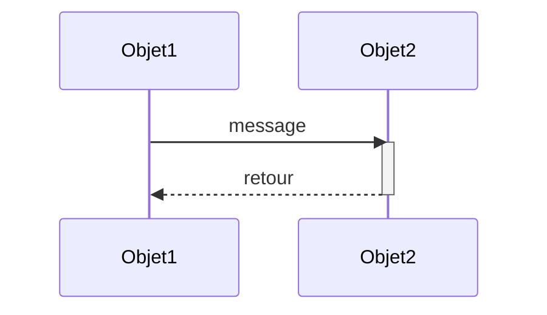
La réponse à la réception d’un message par un objet est appelée une méthode. Une méthode est donc la mise en oeuvre du message: elle décrit la réponse qui doit être donnée au message.

```C
class Point
{
public:
    void afficher(); // méthode publique de la classe Point
};

Point point; // instance de la classe Point

// Réception du message "afficher" :
point.afficher(); // provoque l’appel de la méthode afficher() de la classe Point
```

### A6 - Notion de surdéfinition (ou surcharge)

Il est généralement conseillé d’attribuer des noms distincts à des fonctions différentes. Cependant, lorsque des fonctions effectuent la même tache sur des objets de type différent, il peut être pratique de leur attribuer des noms identiques. L’utilisation d’un même nom pour des fonctions (ou méthodes)
s’appliquant à des types différents est nommée **surcharge**.

Une surdéfinition (ou surcharge) permettra donc d’utiliser plusieurs méthodes qui portent le même nom au sein d’une même classe avec une _signature différente_. Le type de retour ne fait pas partie de la signature d'une fonction (ou d'une méthode). La surcharge ne peut donc s'appliquer que sur le type et/ou le nombre des paramètres.

Ceci est possible uniquement en C++(pas en C).

```C
// Un seul nom au lieu de print_int, print_float, ...
void print( int );
void print( float );

int main ( int argc, char** argv)
{
    int n = 2;
    float x = 2.5;

    print(n); // produit -> je suis print et j’affiche un int : 2
    print(x); // produit -> je suis print et j’affiche un float : 2.

    return 0;
}

void print( int a)
{
    cout << "je suis print et j’affiche un int : " << a << endl;
}

void print( float a)
{
    cout << "je suis print et j’affiche un float : " << a << endl;
}

```

## B - Création de classes et d’objets

### B1 - Construction d’objets

Pour créer des objets à partir d’une classe , il faut un constructeur.

- Un constructeur est chargé d’initialiser un objet de la classe.
- Il est appelé **automatiquement** au moment de la création de l’objet.
- Un constructeur est une méthode qui porte toujours le même nom que la classe.
- Il peut avoir des paramètres, et des valeurs par défaut.
- Il peut y avoir plusieurs constructeurs pour une même classe.
- Le constructeur n’a jamais de type de retour.

Le code C++ ci-dessus correspond à la déclaration de la classe Point. Il doit être écrit dans un fichier header Point.h

```C
// Point.h
class Point
{
private:
    double x;
    double y;

public:
    Point( double x, double y); // constructeur de la classe Point
};

```

Il faut ensuite définir ce constructeur afin qu’il initialise tous les attributs de l’objet au moment de sa création. Toutes les définitions doivent être placées dans un fichier C++ Point.cpp

On doit faire précéder chaque méthode de **Point::** pour préciser au compilateur que ce sont des membres de la classe Point.

Le mot clé "this" permet de désigner l'adresse de l'objet sur laquel le la fonction membre a été appelée. On peut parlerd d'auto-pointeur car l'objet s'auto-désigne (sans connaître son propre nom). 


```C
// Point.cpp

// constructeur de la classe Point
Point::Point( double x, double y)
{
    this->x = x; // on affecte l’argument x à l’attribut x
    this->y = y; // on affecte l’argument y à l’attribut y
}
```


Supposons maintenant une classe Entier:

```C
class Entier
{
private:
    int e;

public:
    Entier(int e)
    {
        this->e = e;
    }

    void affiche() const
    {
        cout << this->e << endl;
    }

};
```

Il est possible d’instancier des objets Entier de la manière suivante :

```C
Entier e1;
e1.affiche(); // affiche 0

int i = 1;
Entier e2 = i;
e2.affiche(); // affiche 1

Entier e3 = ’1’;
e3.affiche(); // affiche 49 (le code ascii de ’1’)
```

L’instanciation de l’objet e2 est réalisée à partir d’une conversion implicite car i est du même type que le paramètre e du constructeur. Il faut retenir qu’il peut donc y avoir un transtypage implicite au moment de la création d’objets. 

Ici, nous avons une conversion implicite d’un char en int ce qui permet d’instancier l’objet e3. Ce n’est probablement pas ce que vous vouliez faire! Il est possible d’interdire (et donc se protéger contre) ces transtypages implicites en indiquant le mot-clé **explicit** dans la déclaration du constructeur :

```C
class Entier
{
private:
    int e;

public:
    explicit Entier( int e)
    {
        this->e = e;
    }

    void affiche() const
    {
        cout << this->e << endl;
    }
};

void afficher(Entier entier)
{
    entier.affiche();
}
```

Essayons maintenant d’instancier ces objets. Et donc, nous obtenons des erreurs suivantes à la compilation

```C
int i = 1;
Entier e2 = i; // erreur i n’est pas un type Entier
e2.affiche();

Entier e3 = ’1’; // erreur ’1’ n’est pas un type Entier
e3.affiche();

afficher(i); // erreur i n’est pas un type Entier
afficher(’5’); // erreur ’5’ n’est pas un type Entier
```

Un type scalaire désigne un type destiné à contenir une valeur atomique (qui n'est pas un type composé). Un entier(int), un nombre flottant(float ou double)sont des valeurs atomiques. Un tableau, une structure ou une classes ont des types composés et ne sont donc pas atomiques.

### B2 - Constructeur par défaut

Si vous essayer de créer un objet sans lui fournir une abscisse x et une ordonnée y, vous obtiendrez le message d’erreur suivant :

erreur: no matching function for call to Point::Point()

Ce type de constructeur se nomme un **constructeur par défaut**. Son rôle est de créer une instance non initialisée quand aucun autre constructeur fourni n’est applicable.

Le constructeur par défaut de la classe Point sera :

```C
Point::Point() // Sans aucun paramètre!
{
    x = 0.;
    y = 0.;
}
```

### B3 - Paramètre par défaut

Le langage C++ offre la possibilité d’avoir des valeurs par défaut pour les paramètres d’une fonction (ou d’une méthode), qui peuvent alors être sous-entendus au moment de l’appel.

Cette possibilité, permet d’écrire qu’un seul constructeur profitant du mécanisme de valeur par défaut :

```C
// Déclaration d’un constructeur (par défaut) de la classe Point
Point( double x=0., double y=0.); // utilisation des paramètres par défaut

// Définition
Point::Point( double x, double y )
{
    this->x = x;
    this->y = y;
}

// Appel du constructeur par défaut de la classe Point (utilise les valeurs par défaut pour x et y)
Point p0; // x=0 et y=0

// Appel du constructeur de la classe Point
Point p1(1 , 2); // x=1 et y=2
Point p2(4 , 0.); // x=4 et y=0

Point p3(5); // x=5 et valeur par défaut pour y
```

### B4 - Liste d’initialisation

Un meilleur moyen d’affecter des valeurs aux données membres de la classe lors de la construction est la liste d’initialisation.

La liste d'initialisation permet d'utiliser le constructeur de chaque donnée membre, et ainsi d'éviter une affectation après coup. la liste d'initialisation doit être utilisée pour certains objets qui ne peuvent pas
être contruits par défaut: c'est le cas des références et des objets constants.La liste d'initialisation est aussi utilisée pour appeler le constructeur d'une classe parente en cas d'héritage.

On va utiliser cette technique pour définir le constructeur de la classe Point:

```C
Point::Point( double x /*=0.*/ , double y /*=0.*/ ) : x(x), y(y)
{
}
```

### B5 - Allocation dynamique d’objet

Pour allouer dynamiquement un objet en C++, on utilisera l’opérateur new. Celui-ci renvoyant une adresse où est créé l’objet en question, il faudra un pointeur pour la conserver. Manipuler ce pointeur, reviendra à manipuler l’objet alloué dynamiquement.

Pour libérer la mémoire allouée dynamiquement en C++, on utilisera l’opérateur delete.

```C
Point *p3; // pointeur (non initialisé) sur un objet de type Point

p3 = new Point(2, 2); // alloue dynamiquement un objet de type Point

cout << "p3 = ";
p3->affiche(); 
/* c'est une adresse, utiliser l’opérateur -> pour accéder aux membres de cet objet */

cout << "p3 = ";
(*p3).affiche(); 
/* cette écriture est possible : pointe sur l’objet puis appelle sa méthode affiche()
*/

delete p3; // ne pas oublier de libérer la mémoire allouée pour cet objet
```

### B6 - Tableau d’objets


Il est possible de conserver et de manipuler des objets Point dans un tableau.

```C
Point tableauDe10Points[10]; 
/* le constructeur par défaut est appelé 10 fois (pour chaque objet Point du tableau)! */
int i;

cout << "Un tableau de 10 Point : " << endl;
for (i = 0; i < 10; i++) {
    cout << "P" << i << " = "; tableauDe10Points[i].affiche();
}
cout << endl;
```

### B7 - Constructeur de copie

Le constructeur de copie est appelé dans :
- la création d’un objet à partir d’un autre objet pris comme modèle
- le passage en paramètre d’un objet par valeur à une fonction ou une méthode
- le retour d’une fonction ou une méthode renvoyant un objet

Toute autre duplication au cours de la vie d'un objet sera faite par l'opérateur d'affectation(=).

La forme habituelle d’un constructeur de copie est la suivante :

```C
class T
{
public:
    T( const T&);
};
```

Donc pour une classe Date:

```C
Date::Date( const Date &d)
{
    // On recopie les attributs un par un
    jour = d.jour;
    mois = d.mois;
    annee = d.annee;
}
```

Par contre, il faut faire très attention avec les classes qui manipulent de la mémoire dynamique et des pointeurs.

On dispose d’une classe PileChar dont le but est de réaliser une structure de pile pouvant traiter des caractères (type char).

La classe PileChar contient trois données membres privées :
- deux entiers strictement positifs, nommés max et sommet
- un pointeur sur un caractère, nommé pile.

Deux situations où le constructeur de copie est nécessaire :

```C
PileChar p2(p1); // Appel du constructeur de copie pour instancier p2

PileChar p2 = p1; // Appel du constructeur de copie pour instancier p2
```

Donc pour la classe PileChar, on écrira ce constructeur de copie:

```C
PileChar::PileChar( const PileChar &p) : max(p.max), sommet(p.sommet)
{
    pile = new char[max]; // on alloue dynamiquement le tableau de caractère

    // on recopie les éléments de la pile
    for (unsigned int i = 0; i < sommet ; i++) 
        pile[i] = p.pile[i];

#ifdef DEBUG
    cout << "PileChar(const PileChar &p) : " << this << "\n";
#endif
}
```

## C - Utilisation d’objets

### C1 - Les services rendus par une classe

Une méthode publique est un service rendu à l'utilisateur de l'objet.

Un point pourra s’afficher. On aura donc une méthode affiche() qui produira un affichage de ce type : (x,y)

A l'intérieur de la méthode affiche() de la classe Point, on peut accéder directement à l'abscisse du point en utilisant la donnée membre x, ou à l'ordonnée en utilisant la donnée membre y.

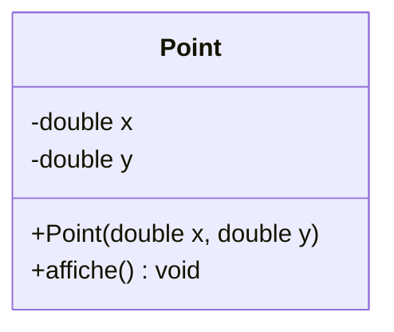

```C
class Point
{
private:
    double x;
    double y;

public:
    Point( double x=0., double y=0.);
    void affiche(); // méthode publique de la classe Point
};

// Définition
Point::Point( double x, double y )
{
    this->x = x;
    this->y = y;
}

void Point::affiche()
{
    cout << '(' << x << ',' << y << ')' << endl;
}

Point p1; // instance de la classe Point
Point p2;

cout << "P1 = ";
p1.affiche();

cout << "P2 = ";
p2.affiche();
```

Ce qui donnera à l’exécution :
```
P1 = (1,2)
P2 = (4,0)
```

### C2 - Les accès contrôlés aux membres d’une classe

Tous les attributs de la classe Point étant privés par respect du principe d’encapsulation, on veut néanmoins pouvoir connaître son abscisse (x) et pouvoir modifier cette dernière.

On doit donc permettre un accès extérieur en lecture et/ou écriture via des méthodes appelées **accesseurs et mutateurs**. L’objet est ainsi vu de l’extérieur comme une «boîte noire» possédant certaines propriétés et ayant un comportement spécifié et sécurisé. C’est les méthodes publiques d’un objet qui modifieront son état (c’est-à-dire la valeur de ses attributs privés).
L’utilisateur de cet objet ne pourra pas lire ou modifier directement une propriété sans passer par un accesseur ou un manipulateur.

- get() ( _getter_ ou **accesseur** ): permet l’accès en lecture
- set() ( _setter_ ou **mutateur** ou manipulateur ): permet l’accès en écriture

La méthode getX() est déclarée constante(const). Une méthode constante est tout simplement une méthode qui ne modife aucun des attributs de l'objet. Il est conseillé de qualifier const toute fonction qui peut l'être car cela garantit qu'on ne pourra appliquer des méthodes constantes que sur un objet constant.


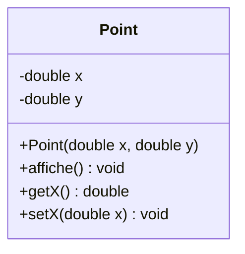

```C
class Point
{
private:
    double x;
    double y;

public:
    Point( double x=0., double y=0.);
    void affiche(); // méthode publique de la classe Point
    double getX();
    void setX(double x);
};

// Définition
Point::Point( double x, double y )
{
    this->x = x;
    this->y = y;
}

// Mutator - accessor
double Point::getX() const
{
    return this->x;
}

void Point::setX(double x) const
{
    this->x = x;
}


void Point::affiche()
{
    cout << '(' << x << ',' << y << ')' << endl;
}

Point p1; // instance de la classe Point
Point p2;

p1.setX(5);     // on peut modifier le membre x de P

// on peut accéder au membre x de P
cout << "L’abscisse de P1 est " << p1.getX() << endl;

// on peut accéder au membre x de P
cout << "L’abscisse de P2 est " << p2.getX() << endl;
```

Ce qui donnera à l’exécution :

```
L’abscisse de P1 est 5
L’abscisse de P2 est 4
```

### C3 - Les objets constants

Les règles suivantes s’appliquent aux objets constants :
- On déclare un objet constant avec le modificateur const.
- On ne pourra pas modifier l’état (ses attributs) d’un objet constant.
- On ne peut appliquer que des méthodes constantes sur un objet constant.
- On déclare et on définit une méthode constante en ajoutant le modificateur const.
- Une méthode constante est tout simplement une méthode qui ne modifie aucun des attributs de l’objet.

Un objet passé en paramètre sous forme de référence constante est considéré comme constant.

```C
const Point p5(7, 8);

cout << "p5 = ";
p5.affiche(); // la méthode affiche() doit être déclarée const [1]
cout << "L’abscisse de p5 est " << p5.getX() << endl;
cout << "L’ordonnée de p5 est " << p5.getY() << endl;
p5.setX(5); // vous ne pouvez pas appeler cette méthode car elle n’est pas const [2]
```

On obtient deux erreurs à la compilation qu’il faudra corriger ([1] et [2]) :

```
erreur: passing ’const Point’ as ’this’ argument of ’void Point::affiche()’ discards qualifiers
erreur: passing ’const Point’ as ’this’ argument of ’void Point::setX(double)’ discards qualifiers
```

## D - Destructeur - La destruction d’objets

Le destructeur est la méthode membre appelée automatiquement lorsqu’une instance
(objet) de classe cesse d’exister en mémoire.

- Son rôle est de libérer toutes les ressources qui ont été acquises lors de la construction (typiquement libérer la mémoire qui a été allouée dynamiquement par cet objet).
- Un destructeur est une méthode qui porte toujours le même nom que la classe, précédé **de "~"**.
- Il existe quelques contraintes pour le destructeur:
    - Il ne possède aucun paramètre.
    - Il n’y en a qu’un et un seul.
    - Il n’a jamais de type de retour.

La forme habituelle d’un destructeur est la suivante :

```C
class T {
public:
    ~T(); // destructeur
};
```

Pour éviter les fuites de mémoire, le destructeur d’une classe PileChar doit libérer la mémoire allouée au tableau de caractères pile:

```C
class PileChar
{
private:
    unsigned int max;
    unsigned int sommet;
    char *pile;

public:
    PileChar( int taille=50); // constructeur par défaut de la classe PileChar
    ~PileChar(); // destructeur de la classe PileChar
};

// Constructeur
PileChar::PileChar( int taille /*=50*/ ) : max(taille), sommet(0) // liste d’initialisation
{
    pile = new char[max]; // allocation dynamique du tableau de caractères
    cout << "PileChar(" << taille << ") : " << this << "\n";
}

// Destructeur
PileChar::~PileChar()
{
    delete [] pile; // libération mémoire du tableau de caractères
    cout << "~PileChar() : " << this << "\n";
}
```

## E - Les opérateurs

### E1 - Opérateur d’affectation

L’opérateur d’affectation (=) est un opérateur de copie d’un objet vers un autre. L’objet affecté est déjà créé sinon c’est le constructeur de copie qui sera appelé.

La forme habituelle d’opérateur d’affectation est la suivante :
```C
class T
{
public:
    T& operator=( const T&);
};
```

Cet opérateur renvoie une référence sur T afin de pouvoir l'utiliser avec d'autres affectations. En effet, l'opérateur d'affectation est associatif à droite a=b=c est évaluée comme a=(b=c). Ainsi, la valeur renvoyée par une affectation doit être à son tour modifiable.

Donc pour une classe Date:
```C
Date& Date::operator = ( const Date &d)
{
    // vérifions si on ne s’auto-copie pas!
    if (this != &d) {
        // Alors on recopie les attributs un par un
        jour = d.jour;
        mois = d.mois;
        annee = d.annee;
    }
    return *this;
}
```

Par contre, il faut faire très attention avec les classes qui manipulent de la mémoire dynamique et des pointeurs :

Pour la classePileChar, la définition de l’opérateur= est la suivante :

```C
PileChar& PileChar::operator = ( const PileChar &p)
{
    // vérifions si on ne s’auto-copie pas!
    if (this != &p) {
        delete[] pile; // on libère l’ancienne pile

        max = p.max;
        sommet = p.sommet;
        pile = new char [max]; // on alloue une nouvelle pile

        for (unsigned int i = 0; i < sommet ; i++) 
            // on recopie les éléments de la pile
            pile[i] = p.pile[i]; 
    }

    return *this;
}
```

Ce qui permettra d’écrire :
```C
PileChar p2; // Appel du constructeur par défaut pour créer pile
p2 = p1; // Appel de l’opérateur d’affectation pour copier p1 dans p2
```

### E2 - Surcharge d’opérateurs

La surcharge d’opérateur permet aux opérateurs du C++ d’avoir une signification spécifique quand ils sont appliqués à des types spécifiques. Parmi les nombreux exemples que l’on pourrait citer :

- myString + yourString pourrait servir à concaténer deux objets string
- maDate++ pourrait servir à incrémenter un objet Date
- a * b pourrait servir à multiplier deux objets Nombre
- e[i] pourrait donner accès à un élément contenu dans un objet Ensemble

Les opérateurs C++ que l’on surcharge habituellement:
- Affectation, affectation avec opération (=, +=, *=, etc.) : **Méthode**
- Opérateur «fonction» (): **Méthode**
- Opérateur «indirection» *: **Méthode**
- Opérateur «crochets» []: **Méthode**
- Incrémentation ++, décrémentation −−: **Méthode**
- Opérateur «flèche» et «flèche appel» -> et ->*: **Méthode**
- Opérateurs de décalage << et >>: **Méthode**
- Opérateurs new et delete: **Méthode**
- Opérateurs de lecture et écriture sur flux << et >>: **Fonction**
- Opérateurs dyadiques genre «arithmétique» (+, -, / etc) : **Fonction**

Les autres opérateurs ne peuvent pas soit être surchargés soit il est déconseillé de le faire.

### E3 - Surcharge d’opérateurs, technique 1, méthode de classe:

La première technique pour surcharger les opérateurs consiste à les considérer comme des méthodes normales de la classe sur laquelle ils s’appliquent.

Le principe est le suivant :

```C
A Op B se traduit par A.operatorOp(B)

t1 == t2; // équivalent à : t1.operator==(t2)
t1 += t2; // équivalent à : t1.operator+=(t2)
```

On surcharge les opérateurs ==, != et += pour la classe PileChar:

```C
class PileChar
{
private:
    unsigned int max;
    unsigned int sommet;
    char *pile;

public:
    bool operator==( const PileChar &p); // teste si deux piles sont identiques
    bool operator!=( const PileChar &p); // teste si deux piles sont différentes
    PileChar& operator+=( const PileChar &p); // empile une pile sur une autre
};

bool PileChar::operator==( const PileChar &p)
{
    if (max != p.max) 
        return false;

    if (sommet != p.sommet) 
        return false;

    for (unsigned int i = 0; i < sommet ; i++) 
        if (pile[i] != p.pile[i]) 
            return false;

    return true;
}

bool PileChar::operator!=( const PileChar &p)
{
    // l’opérateur == a été surchargé!
    return !(*this == p);
}

PileChar& PileChar::operator+=( const PileChar &p)
{
    unsigned int i, j;

    for (i = sommet, j = 0; (j < p.sommet) && (i < max); i++, j++)
        pile[i] = p.pile[j]; // on recopie les éléments de la pile

    sommet += j; // on met à jour le nouveau sommet

    if (sommet == max)
        cerr << "Pile pleine !\n";

    return *this;
}
```

### E4 - Surcharge d’opérateurs, technique 2, fonctions:

La deuxième technique utilise la surcharge d’opérateurs externes sous forme de fonctions. La définition de l’opérateur ne se fait plus dans la classe qui l’utilise, mais en dehors de celle-ci. Dans ce cas, tous les opérandes de l’opérateur devront être passés en paramètres.

L'avantage de cette syntaxe est que l'opérateur est réellement symétrique,contrairement à ce qui se passe pour les opérateurs définis à l'intérieur de la classe.

Le principe est le suivant :
```
A Op B se traduit par operatorOp(A, B)

t1 + t2; // équivalent à : operator+(t1, t2)
```

Les opérateurs externes doivent être déclarés comme étant des fonctions amies(friend) de la classe sur laquelle ils travaillent, faute de quoi ils ne pourraient pas manipuler les données membres de leurs opérandes.

Exemple pour une classe T:
```C
class T
{
private:
    int x;

public:
    friend T operator+( const T &a, const T &b);
};

T operator+( const T &a, const T &b)
{
    // solution n°1 :
    T result = a;
    result.x += b.x;
    return result;

    // solution n°2 : si l’opérateur += a été surchargé
    T result = a;
    return result += b;
}

T t1, t2, t3; // Des objets de type T

t3 = t1 + t2; // Appel de l’opérateur + puis de l’opérateur de copie (=)
t3 = t2 + t1; // idem car l’opérateur est symétrique
```

Par exemple pour la classe Point:
```C
class Point
{
private:
    double x, y;

public:
    //...
    friend Point operator-( const Point & p);
    friend Point operator+( const Point & p1, const Point & p2);
    friend Point operator-( const Point & p1, const Point & p2);
};

Point operator-( const Point & p)
{
    Point pTmp = p;

    pTmp.x *= -1;
    pTmp.y *= -1;

    return pTmp;
}

Point operator+( const Point & p1, const Point & p2)
{
    Point pTmp;

    pTmp.x = p1.x + p2.x;
    pTmp.y = p1.y + p2.y;

    return pTmp;
}

Point operator-( const Point & p1, const Point & p2)
{
    return p1 + (-p2);
}
```

### E5 - La surcharge des opérateurs de flux << et >>

Rappels: Un flux est un canal recevant (flux d’«entrée») ou fournissant (flux de «sortie») de l’information. Ce canal est associé à un périphérique ou à un fichier.

- Un flux d’entrée est un objet de type istream 
- Un flux de sortie est un objet de type ostream
- cout est un flux de sortie prédéfini connecté à la sortie standard stdout.
- cin est un flux d'entrée prédéfini connecté à l'entrée standard stdin.

On surchargera les opérateurs de flux << et >> pour une classe quelconque, sous forme de fonctions amies, en utilisant ces «canevas»:

```C
ostream & operator<<(ostream & sortie, const type_classe & objet1)
{
    // Envoi sur le flux sortie des membres de objet en utilisant
    // les possibilités classiques de << pour les types de base
    // c’est-à-dire des instructions de la forme : sortie << ..... ;
    return sortie ;
}

istream & operator>>(istream & entree, type_de_base & objet)
{
    // Lecture des informations correspondant aux différents membres de objet
    // en utilisant les possibilités classiques de >> pour les types de base
    // c’est-à-dire des instructions de la forme : entree >> ..... ;
    return entree ;
}
```


Si on implémente la surcharge de l’opérateurs de flux de sortie << pour qu’il affiche un objet Point de la manière suivante: (x,y), on pourra alors écrire:

```C
Point p0, p1(4, 0.0), p2(2.5, 2.5);

cout << "P0 = " << p0 << endl;
cout << "P1 = " << p1 << endl;
cout << "P2 = " << p2 << endl;
```

```
Ce qui donnera :
P0 = (0,0)
P1 = (4,0)
P2 = (2.5,2.5)
```

Pour obtenir cela, on écrira :
```C
ostream & operator<<(ostream & os, const Point & p)
{
    os << "(" << p.x << "," << p.y << ")";

    return os;
}
```

Idem pour la surcharge de l’opérateurs de flux d’entrée >> pour qu’il réalise la saisie d’un objet Point de la manière suivante :(x,y).

```C
cout << "Entrez un point : ";
cin >> p0;

if (! cin) {
    cout << "ERREUR de lecture !\n";
    return -1;
}

cout << "P0 = " << p0 << endl;
```

Ce qui donnera :
```
Entrez un point : (2,6)
P0 = (2,6)

Entrez un point : (s,k)
ERREUR de lecture!
```

Pour obtenir cela, on écrira :
```C
istream & operator>>(istream & is, Point & p)
{
    char c;

    if ((c = is.get()) == ’(’)
        is >> p.x;
    else
        is.clear(ios::failbit);

    if ((c = is.get()) == ’,’)
        is >> p.y;
    else
        is.clear(ios::failbit);

    if (is.eof() || ((c = is.get()) != ’)’)) 
        is.clear(ios::failbit);

    if (is.eof()) 
        is.clear(ios::failbit);

    if (! is) {
        p.x = 0.;
        p.y = 0.;
    }

    return is;
}
```

## F - Les membres statiques

### F1 - Les attributs statiques

Un membre donnée déclaré avec l’attribut static est partagé par tous les objets de la même classe. Il existe même lorsque aucun objet de cette classe n’a été créé.

Un membre donnée statique doit être initialisé explicitement, à l’extérieur de la classe (même s’il est privé), en utilisant l’opérateur de résolution de portée (::) pour spécifier sa classe. En général, son initialisation se fait dans le fichier .cpp de définition de la classe.

On va utiliser un membre statique nbPoints pour compter le nombre d’objets Point créés à un instant donné. Il faut maintenant initialiser ce membre statique et compter/décompter le nombre d’objets créés et détruits. Tous les constructeurs de la classe Point doivent incrémenter le membre statique nbPoints!

```C
//Point.h

class Point
{
private:
    double x, y; // attributs de la classe Point
    static int nbPoints; // attribut statique
};
```

```C
// Point.cpp
int Point::nbPoints = 0; // initialisation d’un membre statique

Point::Point() // Constructeur
{
    x = 0.;
    y = 0.;
    nbPoints++; // un objet Point de plus
}

Point::~Point() // Destructeur
{
    nbPoints--; // un objet Point de moins
}
```

### F2 - Les fonctions membres statiques

Lorsqu’une fonction membre a une action indépendante d’un quelconque objet de sa classe, on peut la déclarer avec l’attribut static.

Dans ce cas, une telle fonction peut être appelée, sans mentionner d’objet particulier, en préfixant simplement son nom du nom de la classe concernée, suivi de l’opérateur de résolution de portée (::).

Les fonctions membre statiques :
- ne peuvent pas accéder aux attributs de la classe car il est possible qu’aucun objet de cette classe n’ait été créé.
- peuvent accéder aux membres données statiques car ceux-ci existent même lorsque aucun objet de cette classe n’a été créé.

On va utiliser une fonction membre statique compte() pour connaître le nombre d’objets Point existants à un instant donné.

On déclare une fonction membre statique de la manière suivante :
```C
// Point.h
class Point
{
private:
    double x, y; // attributs de la classe Point
    static int nbPoints; // membre donnée statique

public:
    static int compte(); // méthode statique
};
```

Il faut maintenant définir cette méthode statique:
```C
// Point.cpp
// retourne le nombre d’objets Point existants à un instant donné
int Point::compte()
{
    return nbPoints;
}
```

## G - L’amitié

Rappel :l’unité de protection en C++ est la classe. Ceci implique :
- Une fonction membre peut accéder à tous les membres de n’importe quel objet de sa classe ;
- Par contre, le principe d’encapsulation interdit à une fonction membre d’une classe d’accéder à des données privées d’une autre classe.

L’amitié en C++ permet à des fonctions (ou des méthodes) d’accéder à des membres privées d’une autre classe. Les fonctions amies se déclarent en faisant précéder la déclaration classique de la fonction du mot-clé friend à l’intérieur de la déclaration de la classe cible.

Il est possible de déclarer amie une méthode d'une autre classe, en précisant son nom complet à l'aide de l'opérateur de résolution de portée.

On remarquera plusieurs choses importantes :
- l’amitié n’est pas transitive : les amis des amis ne sont pas des amis. Une classe A amie d’une classe B, elle-même amie d’une classe C, n’est pas amie de la classe C par défaut.
- l’amitié n’est pas héritée : mes amis ne sont pas les amis de mes enfants. Si une classe A est amie d’une classe B et que la classe C est une classe fille de la classe B, alors A n’est pas amie de la classe C par défaut.

L'utilisation des classes amies peut aussi traduire un défaut de conception (classes amies vs classes dérivées).

```C
class A
{
private:
    int a; // Un attribut privé

public:
    A( int a=0) : a(a) {}
    friend void modifierA( int i); // Une fonction amie
};

void modifierA( int i)
{
    A unA;

    unA.a = i; // possible car je suis un ami de la classe A
}
```

Il est aussi possible que toutes les fonctions membres d’une classe soient amies d’une autre classe.

```C
class A
{
private:
    int a; // Un attribut privé

public:
    A( int a=0) : a(a) {}
    // La classe Amie est une amie : elle pourra accéder à mes membres privés
    friend class Amie; 
};

class Amie
{
public:
    void afficherA( void )
    {
        A unA;
        cout << unA.a << endl; // produit : 0
    }
};

int main( void )
{
    Amie amie;

    amie.afficherA();

    return 0;
}
```

## H - Les méthodes inline


C++ présente une amélioration des macros du langage C avec les fonctions inline :
- Elles ont le comportement des fonctions (vérification des arguments et de la valeur de retour) ;
- Elles sont substituées dans le code après vérification.

Il existe deux techniques pour implémenter une fonction inline:

Il est habituellement impératif que la définition de la fonction (la partie entre{ ... }) soit placée dans un fichier d'en-tête(extension.h).Si on la met dans un fichier d'implémentation .cpp dans le cas d'une compilation séparée, on aura "une erreur externe"(fonction non définie) au moment de l'édition de liens.

De manière générale, les fonctions inline (ou les macros) ont les caractéristiques suivantes :
- Avantage : plus rapide qu’une fonction (sauf si la taille du programme devient trop importante) ;
- Inconvénients : comme le code est généré pour chaque appel, le programme binaire produit est plus volumineux. D’autre part, cela complique la compilation séparée.

```C
class Entier
{
private:
    int a;

public:
    /* technique 1: lorsque le corps de la méthode est définie directement dans la déclaration getEntier() est alors inline
    */
    int getEntier() const { return a; }

    void setEntier( int i);
};

/* technique 2: lorsqu’on définit une méthode, on ajoute au début de la définition le mot-clé inline setEntier() est alors inline
*/
inline void Entier::setEntier( int i) 
{
    a = i;
}
```

## I - Les relations entre classes

### I1 - cinq types de relations

Étant donné qu’en POO les objets logiciels interagissent entre eux, il y a donc des relations entre les classes.

On distingue cinq différents types de relations de base entre les classes :
Relation | Type | Cardinalité | Représentation
---------|----------|----------|---------
 Association | Relation "avoir", durable | Cardinalité | trait plein avec ou sans flèche
 Composition | Relation "avoir", durable | Cardinalité | trait plein avec ou sans flèche et un losange plein
 Agrégation | Relation "avoir", durable | Cardinalité | trait plein avec ou sans flèche et un losange vide
 Héritage | Relation "être", durable | pas cardinalité | flèche fermée vide
 Dépendance | Relation "utilise", temporaire | pas cardinalité | flèche pointillée


Représentation des relations en UML

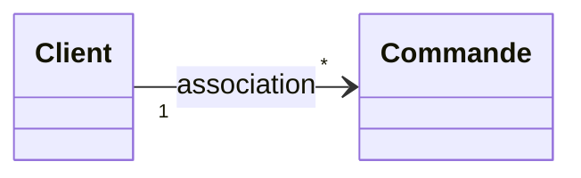

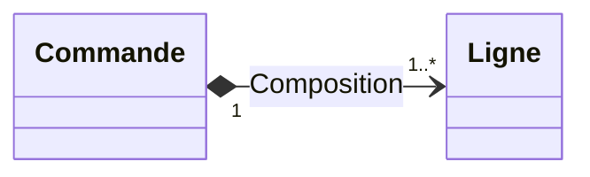

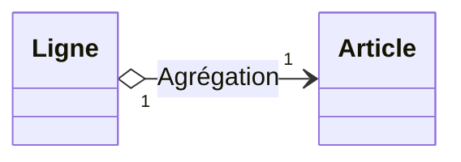

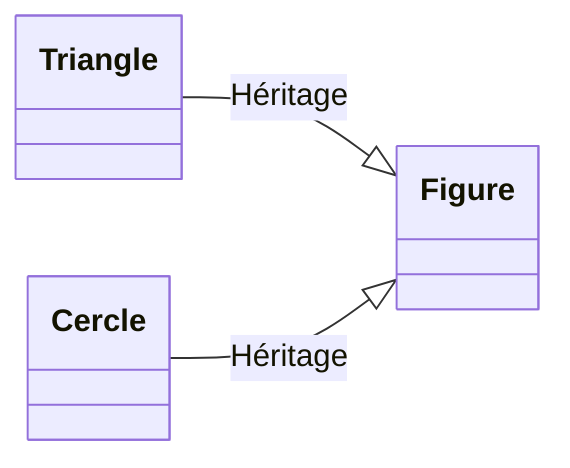

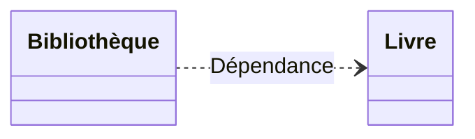

Aux extrémités d’une association, agrégation ou composition, il est possible d’y indiquer une multiplicité (ou cardinalité) pour préciser le nombre d’instances (objets) qui participent à la relation.

Une cardinalité peut s'écrire:
- n (exactement n, un entier positif)
- n..m (de n à m)
- n..* (n ou plus)
- \* (plusieurs)

À l’extrémité d’une association, agrégation ou composition, on donne un nom: c’est le rôle de la relation. Par extension, c’est la manière dont les instances d’une classe voient les instances d’une autre classe au travers de la relation. Ici l’agrégation est nommée monB qui se traduit par un attribut dans la classe A.

La flèche sur la relation précise la navigabilité. Ici, A connaît B mais pas l'inverse. Les relations peuvent être bidirectionnelles (pas de flèche) ou unidirectionnelles (avec une flèche qui précise le sens).

### I2 - La relation d’association

Une association représente une relation sémantique durable entre deux classes. Les associations peuvent donc être nommées pour donner un sens précis à la relation. Si la relation est bidirectionnelle, il n'est pas nécessaire d'utiliser des flèches.


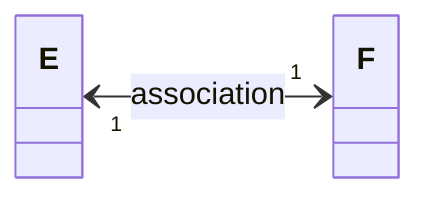

```C
class E
{
private:
    F* monF;    
}

class F
{
private:
    E* monE;
}
```

L’ association se «code» généralement par un pointeur. On peut remarquer que l'association se «code» de la même manière qu'une agrégation.

Ce diagramme de classe ci-dessous illustre une relation d’association 1 vers plusieurs (*) entre :
- Client (une personne qui passe une commande) 
- Commande (qui contient l’ensemble des articles commandés):

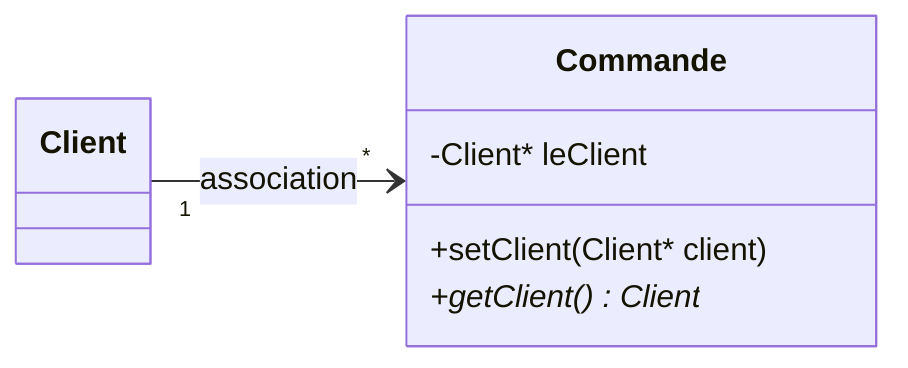

On utilisera des accesseurs get et set pour mettre en oeuvre la relation. Ici,il sera aussi nécessaire d'utiliser un conteneur côté Client pour gérer plusieurs (*) objets Commande.


```C
class Commande
{
private:
    Client *leClient;

public:
    // gestion de l’association
    Client* getClient() const ;
    void setClient(Client* unClient);
};
```

### I3 - La relation d’agrégation

Une agrégation est un cas particulier d’association non symétrique exprimant une relation de contenance. Les agrégations n’ont pas besoin d’être nommées: implicitement elles signifient «contient» ou «est composé de».

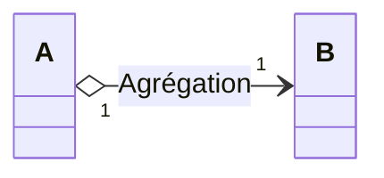

```C
class A
{
private:
    B* monB;
}

class B {}

```

Ici, A est le composite et B le composant. Dans une agrégation, le composant peut être partagé entre plusieurs composites ce qui entraîne que, lorsque le composite A sera détruit, le composant B ne le sera pas forcément.

Une relation d’agrégation s’implémente généralement par un pointeur (pour une relation 1 vers 1).

Le diagramme de classe ci-dessous illustre la relation d’agrégation entre:
- une classe Ligne (qui correspond à un élément d’un type d’article appartenant à une commande) 
- une classe Article (décrivant un article que l’on peut commander)

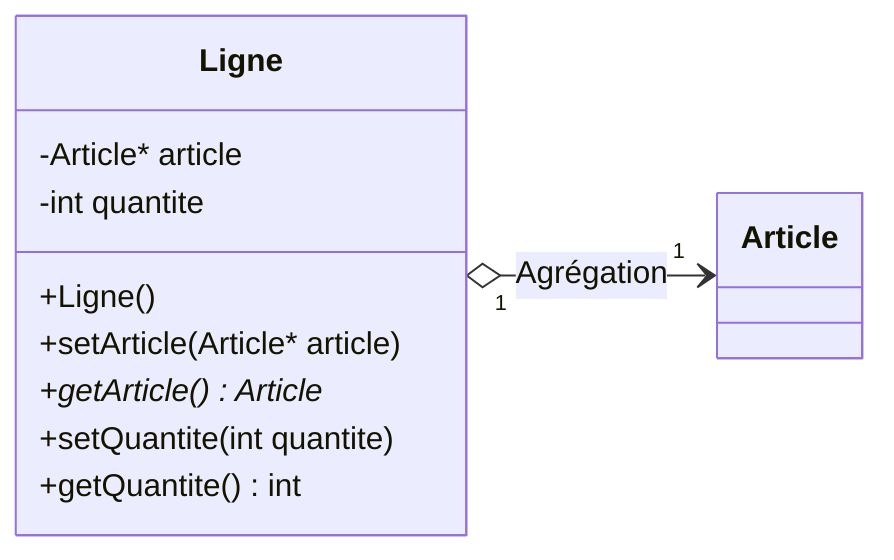

Les accesseurs getArticle() et setArticle() permettent de gérer la relation article.

La relation de composition (voir plus loin) ne serait pas un bon choix pour la relation entre Ligne et Article. En effet, lorsqu'on supprime une ligne d'une commande, on ne doit pas supprimer l'article correspondant qui reste commandable par d'autres clients. D'autre part, un même article peut se retrouver dans plusieurs commandes. Donc, l'agrégation est bien le bon choix.

La déclaration (incomplète) de la classe Ligne intégrant la relation d’agrégation sera:

```C
// Ligne.h
#ifndef LIGNE_H
#define LIGNE_H

class Article; // déclaration: Article est une classe! (1)

class Ligne
{
private:
    Article *article; // l’agrégation
    int quantite;

public:
    Ligne();
    Article* getArticle() const ;
    void setArticle(Article *article);
    int getQuantite() const ;
    void setQuantite(int quantite);
};

#endif //LIGNE_H
```

La définition (incomplète) de la classe Ligne est la suivante :
```C
// Ligne.cpp
#include <iostream>
#include <iomanip>

using namespace std;

#include "Ligne.h"
#include "Article.h" // accès à la déclaration complète de la classe Article (2)

Ligne::Ligne() : article(NULL), quantite(0)
{
}

Article* Ligne::getArticle() const
{
    return article;
}

void Ligne::setArticle(Article* article)
{
    this->article = article;
}

int Ligne::getQuantite() const
{
    return quantite;
}

void Ligne::setQuantite(int quantite)
{
    this->quantite = quantite;
}
```

Voici un exemple d’utilisation de ces deux classes :

```C
Article a1; // un objet Article
Ligne l1; // un objet Ligne

l1.setArticle(&a1); // met en place l’agrégation entre l1 et a1
```

### I4 - La relation de composition

Une composition est une agrégation plus forte signifiant «est composée d’un» et impliquant :
- une partie ne peut appartenir qu’à un seul composite (agrégation non partagée)
- la destruction du composite entraîne la destruction de toutes ses parties (il est responsable du cycle de vie de ses parties).

La composition se représente de la manière suivante en UML :

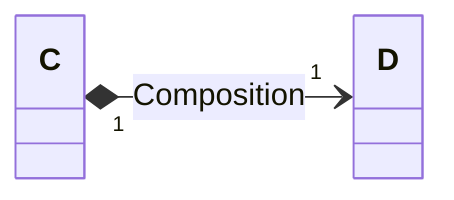

```C
class C
{
private:
    D monD;
}

class C {}
```

La relation de composition peut aussi s'implémenter par pointeur. Dans ce cas, la classe composite a la charge d'allouer et libérer le composant.

Le diagramme de classe ci-dessous illustre la relation de composition entre la classe Commande et la classe Ligne:


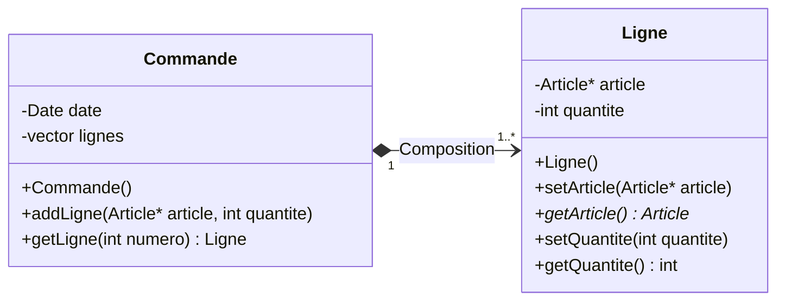

La relation de composition correspond bien à notre besoin car, quand on devra supprimer une commande, on supprimera chaque ligne de celle-ci. D'autre part, une ligne d'une commande ne peut-être partagée avec une autre commande: elle lui est propre.

Dans notre cas, une commande peut contenir une (1) ou plusieurs (*) lignes. Pour pouvoir conserver plusieurs lignes (c’est-à-dire plusieurs objets Ligne), on va utiliser un conteneur de type vector(indiqué dans le diagramme UML ci-dessus par un stéréotype). On aurait pu aussi choisir un conteneur de type 
list ou map.

On n’apporte aucune modification à la classe Ligne existante. On va donc maintenant déclarer (partiellement) la classe Commande:

```C
// Commande.h
#ifndef COMMANDE_H
#define COMMANDE_H

#include <vector>

using namespace std;

// ici il faut un accès à la déclaration complète de la classe Ligne (3)
#include "Ligne.h" 

class Commande
{
private:
    vector<Ligne> lignes; // la composition 1..*

public:
    Commande();
    Ligne getLigne( int numero) const;
    void addLigne(Article* article, int quantite=1);
};

#endif //COMMANDE_H
```

(3) Cette ligne est obligatoire ici car le compilateur a besoin de "connaître complètement" le type Ligne car des objets de ce type vont devoir être construits.

La définition (incomplète) de la classe Commande est la suivante :
```C
// Commande.cpp
#include <iostream>
#include <iomanip>

using namespace std;

#include "Commande.h"

Commande::Commande() {}

Ligne Commande::getLigne( int numero) const
{
    return lignes[numero]; // la vérification de numero serait nécessaire!
}

void Commande::addLigne(Article *article, long quantite)
{
    // Crée une nouvelle ligne de commande :
    Ligne une_ligne(article, quantite);
    lignes.push_back(une_ligne);
}
```

Voici un exemple d’utilisation de ces deux classes :

```C
Article a1;
Article gratuit;
Commande c;

c.addLigne(&a1, 2);
c.addLigne(&gratuit, 1);
```

### I5 - La relation d’héritage

L’ héritage est un concept fondamental de la programmation orientée objet. Elle se nomme ainsi car le principe est en quelque sorte le même que celui d’un arbre généalogique. Ce principe est fondé sur des classes «filles» qui héritent des caractéristiques des classses «mères».

L’héritage permet d’ajouter des propriétés à une classe existante pour en obtenir une nouvelle plus précise. Il permet donc la spécialisation ou la dérivation de types.

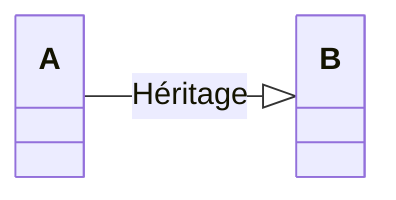

```C
class A {};
class B : public A {};
```

B hérite de A : 
- "un B est un A avec des choses en plus". 
- Toutes les instances de B sont aussi des instances de A.

L’héritage est une relation entre classes qui a les propriétés suivantes :
- si B hérite de A et si C hérite de B alors C hérite de A
- une classe ne peut hériter d’elle-même
- si A hérite de B, B n’hérite pas de A
- il n’est pas possible que B hérite de A, C hérite de B et que A hérite de C
- le C++ permet à une classe C d’hériter des propriétés des classes A et B (héritage multiple)

En utilisant l’héritage, il est possible :
- d’ajouter des caractéristiques (attributs) et/ou des comportements propres (méthodes)
- d’utiliser les caractéristiques héritées
- de redéfinir les comportements (méthodes héritées)

Ne pas confondre la redéfinition (overriding) et la surcharge (overloading):
- Une surdéfinition (ou surcharge) permet d’utiliser plusieurs méthodes qui portent le même nom au sein d’une même classe avec des signatures différentes.
- Une redéfinition (overriding) permet de fournir une nouvelle définition d’une méthode d’une classe ascendante pour la remplacer. Elle doit avoir une signature rigoureusement identique à la méthode parente.

Rappels : Le C++ permet de préciser le type d’accès des membres (attributs et méthodes) d’un objet. Cette opération s’effectue au sein des classes de ces objets.

Il faut maintenant tenir compte de la situation d’héritage :
- public: les membres publics peuvent être utilisés dans et par n’importe quelle partie du programme.
- privé (private): les membres privés d’une classe ne sont accessibles que par les objets de cette classe et non par ceux d’une autre classe même dérivée.
- protégé (protected): les membres protégés d’une classe ne sont accessibles que par les objets de cette classe et par ceux d’une classe dérivée.

Même si l’héritage public est largement le plus utilisé, il existe 3 types d’héritages (ou dérivations) :

Mode de dérivation | Statut classe de base | Statut classe dérivée
---------|----------|---------
 public | public | public
 public | protected | protected
 public | private | innacessible
 protected | public | protected
 protected | protected | protected
 protected | private | innacessible
 private | public | private
 private | protected | private
 private | private | innacessible

Le constructeur de la classe dérivée doit intégralement prendre en charge la construction de l’objet :
- Il peut s’appuyer sur le constructeur de la classe de base , en y faisant appel.
- L’appel au constructeur de la classe mère doit être le premier dans la liste d’initialisation :
    - B::B() : A() pour l’appel au constructeur de la classe mère A sans paramètre.
    - B::B(int a, int b, int c) : A(a,b) pour l’appel au constructeur de la classe mère A avec 2 paramètres.
    - Si aucun appel n’est explicité, le compilateur ajoute un appel implicite au constructeur par défaut s’il existe.

On va définir une classe de base pour représenter toutes des figures : la classe Figure.

```C
#ifndef FIGURE_H
#define FIGURE_H

#include <sstream>
#include <string>

using namespace std;

class Figure
{
protected:
    double x, y, z; // coordonnées du centre

public:
    Figure( double x = 0, double y = 0, double z = 0) : x(x), y(y), z(z) {}
    ~Figure() {}
    string description() const
    {
        return "Figure"; // je suis ...
    }
    string toString() const
    {
        ostringstream oss;
        oss << x << " " << y << " " << z; // mes attributs sous forme de string
        return oss.str();
    }
};
#endif
```

On va maintenant définir sous forme de classe les deux figures géométriques suivantes : le Triangle et le Carre. Évidemment, le triangle est une figure et le carré est une figure. On va donc mettre en oeuvre une relation d’ héritage entre les classes Triangle, Carre et Figure:

Maintenant, il nous reste qu’à utiliser la redéfinition des méthodes description() et toString() de la classe mère Figure.

Rappel: Une redéfinition (overriding) permet de fournir une nouvelle définition d’une méthode d’une classe ascendante pour la remplacer.

```C
#ifndef TRIANGLE_H
#define TRIANGLE_H

#include "Figure.h"

class Triangle : public Figure // Triangle hérite de Figure
{
protected:
    double base, hauteur; // les propriétés spécifiques d’un Triangle

public:
    Triangle( double base, double hauteur, double x = 0, double y = 0): Figure(x, y, 0), base(base), hauteur(hauteur) {}
    ~Triangle() {}
    string description() const // redéfinition pour un Triangle
    {
        return "Triangle"; // je suis plus précisément ...
    }
    string toString() const // redéfinition pour un Triangle
    {
        ostringstream oss;
        oss << base << " " << hauteur; // mes attributs spécifiques
        return Figure::toString() + " " + oss.str();
    }
};
#endif
```

Une classe dérivée (ici la classe Triangle) peut appeler une méthode de la classe de base (ici Figure) de la manière suivante: Figure::toString()

On peut écrire un programme de test où l’on va instancier un triangle :
```C
#include <iostream>

using namespace std;

#include "Figure.h"
#include "Triangle.h"

int main()
{
    Triangle triangle(5,8);

    cout << "Je suis un " << triangle.description() << endl;
    cout << "Mes attributs sont : " << " " << triangle.toString() << endl;

    return 0;
}
```

On obtient l’affichage suivant :
```
Je suis un Triangle
Mes attributs sont : 0 0 0 5 8
```

Conclusion, en utilisant l’héritage, il est possible:
- d’ajouter des caractéristiques (ici une base et une hauteur pour un triangle)
- d’utiliser les caractéristiques héritées (x, y et z) 
- de redéfinir les méthodes héritées (ici description() et to String()).

Le transtypage (cast ou conversion de type) en C++ permet la conversion d’un type vers un autre.
Avec l’héritage, on distinguera :
- transtypage «ascendant» (upcast): changer un type vers son type de base (cela ne pose pas de problème)
- transtypage «descendant» (downcast): conversion d’un pointeur sur un objet d’une classe générale vers un objet d’une classe spécialisée.

Traiter un type dérivé comme s’il était son type de base est appelé transtypage ascendant, surtypage ou généralisation (upcasting). Cela ne pose donc aucun problème.


Transtypage «ascendant»
```C
class Forme {};
class Cercle : public Forme {};
class Triangle : public Forme {};

void faireQuelqueChose(Forme &f) { f.dessiner(); }

Cercle c;

/*
Un Cercle est ici passé à une fonction qui attend une Forme.
Comme un Cercle est une Forme, il peut être traité comme tel par faireQuelqueChose()
*/

faireQuelqueChose(c);
```

La conversion d’un pointeur sur un objet d’une classe générale vers un objet d’une classe spécialisée est un transtypage «descendant» (downcast). Le compilateur ne l’accepte pas et il faut forcer la conversion en utilisant l’opérateur de transtypage dynamic_cast:

Transtypage «descendant» (downcast)
```C
class Animal { public: virtual ~Animal() {} };
class Chien : public Animal {};
class Chat : public Animal {};

int main()
{
    Animal* a = new Chat; // Transtypage ascendant : pas de problème

    // On essaye de le transtyper en Chat* :
    Chat* c1 = a; // Erreur : invalid conversion from ’Animal*’ to ’Chat*’

    Chat* c2 = dynamic_cast <Chat *>(a); // Valide : Transtypage descendant
}
```

### I6 - La relation de dépendance

Lorsqu’un objet “utilise” temporairement les services d’un autre objet, cette relation d’utilisation est une dépendance entre classes.

La plupart du temps, les dépendances servent à montrer qu'une classe utilise une autre comme argument dans la signature d'une méthode. On parle aussi de lien temporaire car il ne dure que le temps de l'exécution de la méthode. Cela peut être aussi le cas d'un objet local à une méthode.

Une dépendance s’illustre par une flèche en pointillée dans un diagramme de classes en UML. Généralement, les dépendances ne sont pas montrées dans un diagramme de classes car elles ne sont qu'une utilisation temporaire donc un détail de l'implémentation sauf si on souhaite les mettre en avant.

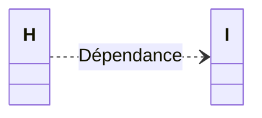

```C
class H
{
    une_methode()
    {
        I un_i;
        // ...
    }

    autre_methode( I un_i)
    {
        // ...
    }    
}

class I {}
```

## J - Le polymorphisme

Le polymorphisme est un moyen de manipuler des objets hétéroclites de la même manière, pourvu qu’ils disposent d’une interface commune. Un objet polymorphe est donc un objet susceptible de prendre plusieurs formes pendant l’exécution. Le polymorphisme représente la capacité du système à choisir dynamiquement la méthode qui correspond au type de l’objet en cours de manipulation.

Le polymorphisme est implémenté en C++ avec les fonctions virtuelles (virtual) et l’héritage.

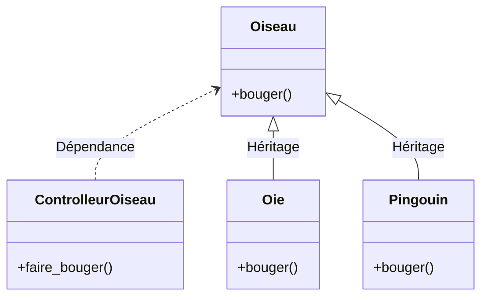

Par exemple, dans le diagramme ci-dessus, l’objet Contrôleur d’oiseaux travaille seulement avec des objets Oiseau génériques, et ne sait pas de quel type ils sont. C’est pratique du point de vue de Contrôleur d’oiseaux, car il n’a pas besoin d’écrire du code spécifique pour déterminer le type exact d’Oiseau avec lequel il travaille, ou le comportement de cet Oiseau.

Comment se fait-il donc que, lorsque faire_bouger() est appelé tout en ignorant le type spécifique de l’Oiseau, on obtienne le bon comportement (une Oie court, vole ou nage, et un Pingouin court ou nage)? La réponse constitue l’astuce fondamentale de la programmation orientée objet: le compilateur ne peut faire un appel de fonction au sens traditionnel du terme. Un appel de fonction généré par un compilateur non orienté objet crée ce qu’on appelle une association prédéfinie : le compilateur génère un appel à un nom de fonction spécifique, et l’éditeur de liens résout cet appel à l’adresse absolue du code à exécuter. En POO, le programme ne peut déterminer l’adresse du code avant la phase d’exécution, un autre mécanisme est donc nécessaire quand un message est envoyé à un objet générique.

Pour résoudre ce problème, les langages orientés objet utilisent le concept d’ association tardive.
Quand un objet reçoit un message, le code appelé n’est pas déterminé avant l’exécution. Le compilateur s’assure que la fonction existe et vérifie le type des arguments et de la valeur de retour, mais il ne sait pas exactement quel est le code à exécuter.

Pour créer une association tardive, le compilateur C++ insère une portion spéciale de code en lieu et place de l’appel absolu. Ce code calcule l’adresse du corps de la fonction, en utilisant des informations
stockées dans l’objet. Ainsi, chaque objet peut se comporter différemment suivant le contenu de cette portion spéciale de code. Quand un objet reçoit un message, l’objet sait quoi faire de ce message.

En pratique, on déclare qu’on veut une fonction qui ait la flexibilité des propriétés de l’association tardive en utilisant le mot-clé virtual. En C++, on doit se souvenir d’ajouter le mot-clé virtual (devant une méthode) parce que, par défaut, les fonctions membres ne sont pas liées dynamiquement. Les fonctions
virtuelles permettent d’exprimer des différences de comportement entre des classes de la même famille.

Ces différences sont ce qui engendre un comportement polymorphe.


Tout d’abord, on va observer un comportement non polymorphe :
```C
#include <iostream>

using namespace std;

class Forme
{
public:
    Forme() { cout << "constructeur Forme <|- "; }
    void dessiner() { cout << "je dessine une forme\n"; }
};

class Cercle : public Forme
{
public:
    Cercle() { cout << "constructeur Cercle\n"; }
    void dessiner() { cout << "je dessine un Cercle\n"; }
};

class Triangle : public Forme
{
public:
    Triangle() { cout << "constructeur Triangle\n"; }
    void dessiner() { cout << "je dessine un Triangle\n"; }
};

void faireQuelqueChose(Forme &f)
{
    f.dessiner(); // dessine une Forme
}

int main()
{
    Cercle c;
    Triangle t;

    faireQuelqueChose(c); // avec un cercle
    faireQuelqueChose(t); // avec un triangle

    return 0;
}
```

L’exécution du programme d’essai nous montre que nous n’obtenons pas un comportement polymorphe puisque c’est la méthode dessiner() de la classe Forme qui est appelée :

```
constructeur Forme <|- Cercle
constructeur Forme <|- Triangle
je dessine une forme
je dessine une forme
```

Pour obtenir un comportement polymorphe, on va déclarer virtuelle la méthode dessiner():

```C
#include <iostream>

using namespace std;

class Forme
{
public:
    Forme() { cout << "constructeur Forme <- "; }
    // la méthode dessiner sera virtuelle et fournira un comportement polymorphe
    virtual void dessiner() { cout << "je dessine ... une forme ?\n"; }
};

class Cercle : public Forme
{
public:
    Cercle() { cout << "Cercle\n"; }
    void dessiner() { cout << "je dessine un Cercle !\n"; }
};

class Triangle : public Forme
{
public:
    Triangle() { cout << "Triangle\n"; }
    void dessiner() { cout << "je dessine un Triangle !\n"; }
};

void faireQuelqueChose(Forme &f)
{
    f.dessiner(); // dessine une Forme
}

int main()
{
    Cercle c;
    Triangle t;

    faireQuelqueChose(c); // avec un cercle
    faireQuelqueChose(t); // avec un triangle

    return 0;
}
```
L’exécution du programme d’essai nous montre maintenant que nous obtenons un comportement polymorphe puisque c’est la “bonne“ méthode dessiner() qui est appelée.

```
constructeur Forme <|- Cercle
constructeur Forme <|- Triangle
je dessine un Cercle!
je dessine un Triangle!
```

Conclusion : Le C++ permet, par le polymorphisme, que des objets de types différents (Cercle, Triangle, ...) répondent différemment à un même appel de fonction (dessiner()).

On a vu que le constructeur de la classe dérivée prenait intégralement en charge la construction de l’objet en appelant le constructeur de la classe de base. L’ appel des destructeurs peut poser quelques problèmes :

```C
class A
{
private:
    int *p;

public:
    A() { p = new int [4]; cout << "A()"; }
    ~A() { delete [] p; cout<< " ~A()" << endl; }
};

class B : public A
{
private:
    int *q;

public:
    B() { q = new int [64]; cout<< "B() et q=" << q; }
    ~B() { delete [] q; cout<< " ~B()"; }
};

int main()
{
    A *pA = new B(); // correct B est un A

    delete pA; // A()B() et q=0x100170 ~A()
}
```

L'affichage met en évidence un problème de "fuite" de mémoire. Le destructeur de B n'est jamais appelé!

La solution : déclarer virtuel le destructeur de la classe de base. Avec la déclaration du destructeur de A en virtuel (virtual), le destructeur de B est correctement appelé.

```C
class A
{
private:
    int *p;
public:
    A() { p = new int [4]; cout << "A()"; }
    virtual ~A() { delete [] p; cout<< " ~A()" << endl; }
};

class B : public A
{
private:
    int *q;

public:
    B() { q = new int [64]; cout<< "B() et q=" << q; }
    ~B() { delete [] q; cout<< " ~B()"; }
};

int main()
{
    A *pA = new B();

    delete pA; // A()B() et q=0x100170 ~B() ~A()
}
```


## K - Les classes abstraites

Quelquefois, la modélisation d’un concept très général conduit à laisser des «trous» dans l’implémentation. Une classe abstraite permet d’introduire certaines méthodes dont on ne peut encore donner aucune définition.

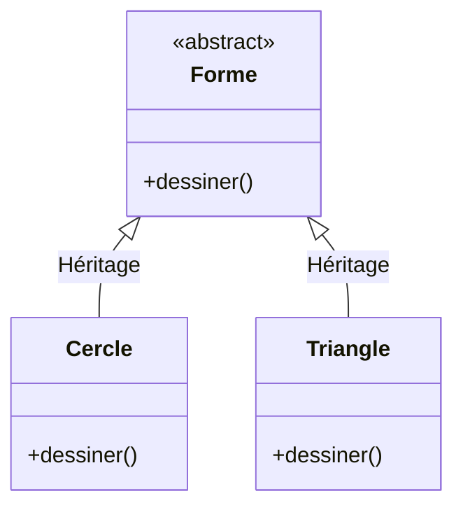
En UML:
- une classe abstraite est en italique
- une méthode abstraite (virtuelle pure en C++) est en italique

Par exemple, on ne sait pas programmer ce que doit faire la fonction dessiner()dans le contexte de Forme. On veut juste s’assurer de sa présence dans toutes les classes filles, sans devoir la définir dans la classe parente.

En C++, une classe est dite abstraite si elle contient au moins une fonction virtuelle pure.
Une fonction membre est dite virtuelle pure lorsqu’elle est déclarée de la façon suivante :

```C
virtual type nomMethode(paramètres) = 0;
```

On ne peut pas instancier d’objet à partir d’une classe abstraite. Mais on le peut à partir d’une classe dérivée à condition qu’elle définisse complètement la méthode vituelle pure.

```C
// La classe Forme ne peut pas être instanciée : elle est dite abstraite
class Forme
{
public:
    Forme() {}
    /* la méthode dessiner est virtuelle pure et ne possède aucune définition
    cela oblige tous les descendants à contenir une méthode dessiner()
    */
    virtual void dessiner() = 0;
};

/* Une classe dans laquelle il n’y a plus aucune fonction virtuelle pure devient instanciable
*/
class Cercle : public Forme
{
public:
    Cercle() {}
    void dessiner() { cout << "je dessine un Cercle !\n"; }
};

class Triangle : public Forme
{
public:
    Triangle() {}
    void dessiner() { cout << "je dessine un Triangle !\n"; }
};
```

En C++, il y a une autre technique qui permet d'obtenir une classe abstraite: en plaçant tout simplement le constructeur de la classe en privé ou protégé.

## L - Les exceptions

Les exceptions ont été ajoutées à la norme du C++ afin de faciliter la mise en œuvre de code robuste.
Une exception est l’ interruption de l’exécution du programme à la suite d’un événement particulier (= exceptionnel !) et le transfert du contrôle à des fonctions spéciales appelées gestionnaires.

Le but des exceptions est de réaliser des traitements spécifiques aux événements qui en sont la cause.
Ces traitements peuvent :
- rétablir le programme dans son mode de fonctionnement normal, auquel cas son exécution reprend
- arrêter le programme si aucun traitement n’est approprié.

La gestion d’une exception est découpée en deux parties distinctes :
- le déclenchement : l’instruction throw
- le traitement (l’inspection et la capture) : deux instructions inséparables try et catch

Lancer une exception consiste à retourner une erreur sous la forme d’une valeur (message, code, objet exception) dont le type peut être quelconque (int, char*, MyExceptionClass, ...). Le lancement (ou déclenchement) se fait par l’instruction throw suivie d’une valeur :

```C
// lance (ou lève) une exception de type int comme un code d’erreur!
throw -1;
```

L'exception peut être relancée en utilisant l'instruction: throw.

Il faut au moins un bloc try et catch pour surveiller et attraper les exceptions. Dans le cas contraire, le système récupère l’exception et met fin au programme (appel immédiat de la fonction terminate).

```C
try {
    // ...
}
catch ( int & e) {
    cerr << "Une exception s’est produite! Exception Numero : " << e << endl;
}
catch (...) {
    // traite toutes les autres exceptions
    cerr << "Erreur inconnue.\n";
}
```

Lorsque une instruction provoque une exception (incluse dans un bloc try), le programme saute directement vers les gestionnaires d’exception (blocs catch) qu’il examine séquentiellement dans l’ordre du code source.

En aucun cas il n'est possible de poursuivre l'exécution à la suite de la ligne de code fautive. L'exécution normale reprend après le bloc try ... catch ...et non après le throw.

Les exceptions doivent être de préférence déclenchées par valeur, et attrapée par référence.

Exemple : lancer et attraper une exception
```C
#include <iostream>
#include <stdexcept> // pour std::range_error

using namespace std;

double inverse( int x)
{
    // risque d’une division par 0?
    if (x == 0)
        // lance une exception
        throw range_error("Division par zero !"); // et on sort de la fonction

    return 1 / (double)x;
}

int main()
{
    try {
        cout << "1/2 = " << inverse(2) << endl;
        cout << "1/0 = " << inverse(0) << endl;
        cout << "1/3 = " << inverse(3) << endl;
    }
    catch (range_error &e) {
        // traitement local
        cout << "Exception : " << e.what() << endl;
    }

    cout << "Fin du programme" << endl;
    return 0;
}
```

On obtient :
```
1/2 = 0.5
Exception : Division par zero!
Fin du programme
```

C++ comprend un ensemble de classes d’exception pour gérer automatiquement les erreurs de division par zéro, les erreurs d’E/S, les transtypages incorrects et de nombreuses autres conditions d’exception. Toutes les classes d’exception dérivent d’une classe mère appelée exception. 
La classe exception encapsule les propriétés et les méthodes fondamentales de toutes les exceptions et fournit une interface pour les applications gérant leurs exceptions.

Il est donc souvent préférable de créer son type d’exception qui hérite de la classe de base exception, déclarée dans l’entête <exception>. Cette classe possède une fonction membre virtuelle what()qu’il convient de redéfinir.

```C
class MonException : public exception
{
private:
    string cause;
public:
    MonException(string c) throw() : cause(c) {}
    ~MonException() throw() {}
    const char* what() const throw() { return cause.c_str(); }
};
```

Exemple :
```C
throw MonException("Il y a un problème !");
```

## M - Les templates

En C++, la fonctionnalité template fournit un moyen de réutiliser du code source.
Les templates permettent d’écrire des fonctions et des classes en paramétrant le type de certains de leurs constituants (type des paramètres ou type de retour pour une fonction, type des éléments pour une classe collection par exemple). Les templates permettent d’écrire du code générique, c’est-à-dire qui peut servir pour une famille de fonctions ou de classes qui ne diffèrent que par la valeur de ces paramètres.

En résumé, l’utilisation des templates permet de « paramétrer » le type des données manipulées.

Déclaration d’un modèle :
```
template <class| typename nom[=type] [, class| typename nom[=type][...]>
```

où nom est le nom que l’on donne au type générique dans cette déclaration. Le mot clé class a ici exactement la signification de "type". Il peut d’ailleurs être remplacé indifféremment dans cette syntaxe par le mot clé typename. On peut déclarer un nombre arbitraire de types génériques, en les séparant par des virgules.
```
template <type parametre[=valeur][, ...]>
```
où type est le type du paramètre constant, parametre est le nom du paramètre et valeur est sa valeur par défaut.

Après la déclaration d’un ou de plusieurs paramètres template suit en général la déclaration ou la définition d’une fonction ou d’une classe template. Dans cette définition, les types génériques peuvent être utilisés exactement comme s’il s’agissait de types normaux.

```
// Fonction template :
template <class T> T mini(T a, T b);

// Classe template :
template <class T> class Array { T a ; };
```

Le template de fonction est généralement appelé algorithme (comme la plupart des templates de fonctions dans la bibliothèque standard stl du C++). Il dit juste comment faire quelque chose.

Exemple : fonction template
On désire écrire une fonction mini()qui reçoit deux arguments et qui retourne le plus petit des deux. Pour éviter d’écrire autant de fonctions mini que de types à gérer, on va utiliser un template de fonction. Ce sera le compilateur qui «générera le code pour chaque type utilisé» (ici int et float):

```C
#include <iostream>

using namespace std;

template <class T> T mini(T a, T b)
{
    if (a < b) return a;
    else return b;
}

template <class T> T mini(T a, T b, T c)
{
    return mini(mini(a, b), c);
}

int main()
{
    int n=12, p=15, q=2;
    float x=3.5, y=4.25, z=0.25;

    cout << "mini(n, p) -> " << mini(n, p) << endl; // implicite

    cout << "mini(n, p, q) -> " << mini(n, p, q) << endl;
    cout << "mini(x, y) -> " << mini(x, y) << endl;
    cout << "mini(x, y, z) -> " << mini(x, y, z) << endl;
    cout << "mini(n, p) -> " << mini<float>(n, q) << endl; // explicite
}
```

Lorsqu’une fonction ou une classe template a été définie, il est possible de la spécialiser pour un certain jeu de paramètres template. Il faut faire précéder la définition de cette fonction ou de cette classe par la ligne suivante: template <>. Ceci permet de signaler que la liste des paramètres template pour cette spécialisation est vide et donc que la spécialisation est totale. Si un seul paramètre est spécialisé,
on parle de spécialisation partielle.

Exemple : spécialisation
Par exemple dans l’exemple précédent, on ne peut pas utiliser la fonction template mini() avec le type char* (les chaînes de caractères en C n’admettent pas l’opérateur 
inférieur<). Dans ce cas là, on fera alors une spécialisation totale pour ce type :

```C
template <> const char *mini( const char *a, const char *b)
{
    return (strcmp( a, b ) < 0)? a : b;
}
```

```C
// Exemple :
cout << mini("hello", "word") << endl;
```

Exemple : une classe template
On désire réaliser une classe conteneur de type Tableau. Là encore, il faudrait réécrire cette classe pour chaque type à collecter. On va donc créer une classe template unique. Ce sera le compilateur qui «générera le code pour chaque type utilisé» (ici int et float):

```C
#include <iostream>

using namespace std;

template <class T> class Array // avec des méthodes inline
{
private:
    enum { size = 100 };
    T A[size];

public:
    // ...
    T& operator[]( int index)
    {
        if (index >= 0 && index < size) return A[index];
        else cerr << "Index out of range" << endl;
    }
};

int main()
{
    Array< int > ia; // un "tableau" d’entiers (ici T = int)
    Array< float > fa; // un "tableau" de réels (ici T = float)

    for ( int i = 0; i < 20; i++) {
        ia[i] = i * i;
        fa[i] = float (i) * 1.414;
    }

    for ( int j = 0; j < 20; j++)
        cout << j << ": " << ia[j] << ", " << fa[j] << endl;
}

```
