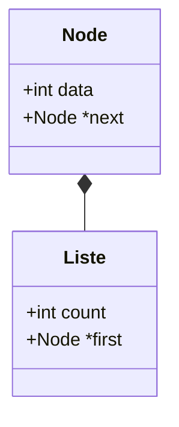

# Liste chainée pratique

Nous allons créer une liste simplement chainée contenant des entiers.
Vous pouvez créer des listes chaînées contenant n'importe quel type d'éléments : entiers, chaines caractères, structures, tableaux, voir même d'autres listes chaînées...

## Définition des types de données

- On crée le type Node qui est une structure contenant un entier (data) et un pointeur sur le prochain élément (next). 
- On crée le type Liste contenant le nombre d'éléments (count) et un pointeur sur le premier élément.



liste.h:
```C
!!!include(liste.h)!!!
```

## La première liste 
etape1.c:
```C
!!!include(etape1.c)!!!
```

## Création d'une liste vide

etape2.c:
```C
!!!include(etape2.c)!!!
```

liste.c: voir ci-dessous

Il est important de toujours initialiser la liste chaînée à NULL. Le cas échéant, elle sera considérée comme contenant au moins un élément. C'est une erreur fréquente. A garder en mémoire, il est plus sage de toujours initialiser vos pointeurs.

## Fonctions C de gestion dynamique de la mémoire

```
SYNOPSIS

#include <stdlib.h>

void *malloc(size_t size);
void free(void *ptr);

DESCRIPTION

The malloc() function allocates size bytes and returns a pointer
to the allocated memory.  The memory is not initialized.  If size
is 0, then malloc() returns either NULL, or a unique pointer
value that can later be successfully passed to free().

The free() function frees the memory space pointed to by ptr,
which must have been returned by a previous call to malloc().Otherwise, or if free(ptr) has already been called before, undefined behavior occurs.  If ptr is NULL, no operation is performed.

RETURN VALUE

The malloc() function return a pointer to the
allocated memory, which is suitably aligned for any built-in
type.  On error, these functions return NULL.  NULL may also be
returned by a successful call to malloc() with a size of zero.

The free() function returns no value.
```

## Allocation dynamique d'un élément

etape3.c:
```C
!!!include(etape3.c)!!!
```

## Ajout d'un élément en tête de liste

etape4.c

```C
!!!include(etape4.c)!!!
```
## liste.c : fonctions de gestion des listes

liste.c:
```C
!!!include(liste.c)!!!
```
