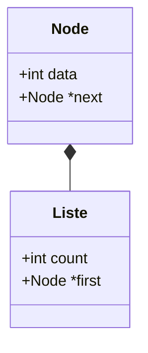

# Liste chainée pratique

Nous allons créer une liste simplement chainée contenant des entiers.
Vous pouvez créer des listes chaînées contenant n'importe quel type d'éléments : entiers, chaines caractères, structures, tableaux, voir même d'autres listes chaînées...

## Définition des types de données

- On crée le type Node qui est une structure contenant un entier (data) et un pointeur sur le prochain élément (next). 
- On crée le type Liste contenant le nombre d'éléments (count) et un pointeur sur le premier élément.



extrait liste.h:
```C
// Element de la liste
typedef struct node {
    int data;
    struct node *next;
} Node;

// Entete de la liste
typedef struct liste {
    int count;
    Node *first;
} Liste;
```

## La première liste 

etape1.c:
```C
#include <stdlib.h>
#include <stdio.h>
#include "liste.h"

int main()
{
    Liste liste;
    Node node;          // creation statique
    Node *p;

    // Initialisation de la liste
    liste.count = 0;
    liste.first = NULL;

    // Initialisation du noeud
    node.data = 42;
    node.next = NULL;

    // Ajout du noeud à la liste
    liste.first = &node;
    liste.count++;

    // Affichage de l'entete de la liste
    printf("Entete liste: count=%d first=%p\n", liste.count, liste.first);

    // Affichage des elements de la liste
    p = liste.first;
    while (p != NULL) {
        printf("\tElement: data:%d next:%p\n", p->data, p->next);
        p = p->next;
    }

    return EXIT_SUCCESS;
}
```

## Création d'une liste vide

etape2.c:
```C
#include <stdlib.h>
#include <stdio.h>
#include "liste.h"

int main()
{
    Liste liste;
    
    liste_init(&liste);
    liste_print_entete(&liste);

    return EXIT_SUCCESS;
}
```

liste.c:
```C
#include <stdlib.h>
#include <stdio.h>
#include "liste.h"

// Etat initial d'une liste
void liste_init( Liste *liste )
{
    liste->count = 0;
    liste->first = NULL;
}

// Affichage données de la l'entete de la liste
void liste_print_entete( Liste *liste )
{
    printf("Entete liste: count=%d first=%p\n", liste->count, liste->first);
}
```

Il est important de toujours initialiser la liste chaînée à NULL. Le cas échéant, elle sera considérée comme contenant au moins un élément. C'est une erreur fréquente. A garder en mémoire, il est plus sage de toujours initialiser vos pointeurs.

## Fonctions C de gestion dynamique de la mémoire

```
SYNOPSIS

#include <stdlib.h>

void *malloc(size_t size);
void free(void *ptr);

DESCRIPTION

The malloc() function allocates size bytes and returns a pointer
to the allocated memory.  The memory is not initialized.  If size
is 0, then malloc() returns either NULL, or a unique pointer
value that can later be successfully passed to free().

The free() function frees the memory space pointed to by ptr,
which must have been returned by a previous call to malloc().Otherwise, or if free(ptr) has already been called before, undefined behavior occurs.  If ptr is NULL, no operation is performed.

RETURN VALUE

The malloc() function return a pointer to the
allocated memory, which is suitably aligned for any built-in
type.  On error, these functions return NULL.  NULL may also be
returned by a successful call to malloc() with a size of zero.

The free() function returns no value.
```

## Allocation dynamique d'un élément

etape3.c:
```C
#include <stdlib.h>
#include <stdio.h>
#include "liste.h"

int main()
{
    Liste liste;
    Node *node;          // creation dynamique

    liste_init(&liste);    // Initialisation de la liste
    
    // Allocation dynamique d'un noeud
    node = malloc( sizeof(Node) );
    if (node == NULL) {
        fprintf(stderr, "Erreur allocation mémoire\n");
        exit(EXIT_FAILURE);
    }

    // Initialisation du noeud
    node->data = 42;
    node->next = NULL;

    // Ajout du noeud à la liste
    liste.first = node;
    liste.count++;

    liste_print_entete(&liste); // Affichage de la liste
    liste_print( &liste);

    // Libération de la mémoire allouée
    free(node);

    return EXIT_SUCCESS;
}

```

extrait liste.c:
```C
// Affichage des elements de la liste
void liste_print( Liste *liste)
{
    Node *p = liste->first;

    while (p != NULL) {
        printf("\tElement: data:%d next:%p\n", p->data, p->next);
        p = p->next;
    }
}
```

## Ajout d'un élément en tête de liste

etape4.c

```C
#include <stdlib.h>
#include <stdio.h>
#include "liste.h"

int main()
{
    Liste liste;
    Node *node;          // creation dynamique

    liste_init(&liste);    // Initialisation de la liste
    
    // Création de 4 noeuds
    for (int i = 0; i < 4; i++) {
        node = node_create(i);
        node_set_next(node, liste.first);
        liste.first = node;
        liste.count++;
    }

    liste_print_entete(&liste); // Affichage de la liste
    liste_print( &liste);

    // Libération de la mémoire allouée
    liste_free(&liste);

    return EXIT_SUCCESS;
}
```

extrait liste.c:
```C
// Creation dynamique d'un noeud
Node *node_create(int data)
{
    Node *node;          // creation dynamique

    node = malloc( sizeof(Node) );
    if (node == NULL) {
        fprintf(stderr, "Erreur allocation mémoire\n");
        exit(EXIT_FAILURE);
    }

    // Initialisation du noeud
    node->data = data;
    node->next = NULL;

    return(node);
}

// Affecter element suivant à un noeud
void node_set_next(Node *node, Node *next)
{
    node->next = next;
}

// Libération de la mémoire allouée pour les éléments de la liste
void liste_free(Liste *liste)
{
    Node *p = liste->first;
    Node *p_next;

    while (p != NULL) {
        p_next = p->next;
        free(p);
        p = p_next;
    }
}
```
