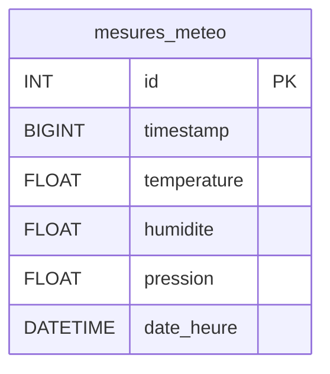

# Correction : Exploitation de données météorologiques en C et MySQL

---

## Partie 1 — Analyse du fichier (4 points)

### 1.1 Taille totale théorique
- 144 enregistrements × 16 octets = **2304 octets**

### 1.2 Vérification
- 2304 ÷ 16 = 144 → division entière → **OK**

### 1.3 Importance de la taille d'enregistrement
- Permet de lire correctement chaque enregistrement sans décalage
- Évite les erreurs de parsing (alignement mémoire)
- Indispensable pour calculer le nombre d'enregistrements

### 1.4 od vs cat
- `cat` affiche le contenu comme du texte (interprète les octets comme caractères)
- `od` (octal dump) affiche les octets en hexadécimal/octal, montre la structure binaire
- Le fichier contient des données binaires non-ASCII → `cat` affiche des caractères incohérents

```bash
$ od -A x -t x1z -v weather_data.bin | head -n 10
000000 00 b9 55 69 0a d7 9d 41 71 bd 9f 42 f6 18 7e 44  >..Ui...Aq..B..~D<
000010 58 bb 55 69 c3 f5 98 41 1f 85 47 42 29 8c 7e 44  >X.Ui...A..GB).~D<
000020 b0 bd 55 69 5c 8f b0 41 52 b8 8b 42 66 86 7d 44  >..Ui\..AR..Bf.}D<
000030 08 c0 55 69 8f c2 9f 41 a4 70 4e 42 1f d5 7b 44  >..Ui...A.pNB..{D<
000040 60 c2 55 69 52 b8 9a 41 29 5c 69 42 1f 45 7c 44  >`.UiR..A)\iB.E|D<
000050 b8 c4 55 69 9a 99 a7 41 00 00 43 42 52 88 7b 44  >..Ui...A..CBR.{D<
000060 10 c7 55 69 71 3d aa 41 48 e1 a1 42 3d 7a 7f 44  >..Uiq=.AH..B=z.D<
000070 68 c9 55 69 33 33 a5 41 14 2e 92 42 cd 8c 7e 44  >h.Ui33.A...B..~D<
000080 c0 cb 55 69 71 3d 9e 41 00 00 80 42 b8 6e 7a 44  >..Uiq=.A...B.nzD<
000090 18 ce 55 69 66 66 9c 41 f6 a8 8d 42 d7 c3 7b 44  >..Uiff.A...B..{D<
```

---

## Partie 2 — Définition des structures (3 points)

### 2.1 Structure C

```c
#include <stdint.h>

typedef struct {
    int32_t timestamp;
    float temperature;
    float humidite;
    float pression;
} meteo_t;
```

### 2.2 Justification des types
- `int32_t` : timestamp UNIX sur 32 bits (4 octets), suffixe pour la période de mesure (24h)
- `float` : suffisant pour température, humidité, pression (précision ~6 chiffres)

---

## Partie 3 — Lecture du fichier binaire (5 points)

```c
#include <stdio.h>
#include <stdint.h>

typedef struct {
    int32_t timestamp;
    float temperature;
    float humidite;
    float pression;
} meteo_t;

int main() {
    FILE *f = fopen("meteo.bin", "rb");
    if (!f) {
        perror("Erreur ouverture");
        return 1;
    }

    meteo_t m;
    while (fread(&m, sizeof(meteo_t), 1, f) == 1) {
        printf("%d | %.1f°C | %.1f%% | %.1f hPa\n",
               m.timestamp, m.temperature, m.humidite, m.pression);
    }

    fclose(f);
    return 0;
}
```

### 3.1 Mode "rb" (read binary)
### 3.2 fread() lit enregistrement par enregistrement
### 3.3 Stockage dans la structure meteo_t
### 3.4 Affichage formaté avec printf()
### 3.5 Vérification de fopen() et fread()

---

## Partie 4 — Exploitation des données (4 points)

```c
#include <stdio.h>
#include <stdint.h>
#include <time.h>

typedef struct {
    int32_t timestamp;
    float temperature;
    float humidite;
    float pression;
} meteo_t;

int main() {
    FILE *f = fopen("meteo.bin", "rb");
    if (!f) return 1;

    meteo_t m;
    float somme = 0, min = 100, max = -100;
    int32_t ts_max;
    int count = 0;

    while (fread(&m, sizeof(meteo_t), 1, f) == 1) {
        count++;
        somme += m.temperature;
        if (m.temperature > max) {
            max = m.temperature;
            ts_max = m.timestamp;
        }
        if (m.temperature < min) min = m.temperature;
    }

    printf("Moyenne: %.1f°C\n", somme / count);
    printf("Min: %.1f°C | Max: %.1f°C\n", min, max);

    struct tm *t = localtime((time_t*)&ts_max);
    printf("Max à: %02d:%02d\n", t->tm_hour, t->tm_min);

    fclose(f);
    return 0;
}
```

---

## Partie 5 — Conception de la base de données (4 points)

### 5.1 Schéma relationnel

```
Table: mesures_meteo
| Champ        | Type         | Clé |
|--------------|--------------|-----|
| id           | INT AUTO_INC | PK  |
| timestamp    | BIGINT       |     |
| temperature  | FLOAT        |     |
| humidite     | FLOAT        |     |
| pression     | FLOAT        |     |
| date_heure   | DATETIME     |     |
```

Voici le code **Mermaid** en Markdown correspondant à ton schéma relationnel :




### 5.2 Requête SQL

```sql
CREATE DATABASE IF NOT EXISTS meteo_db;
USE meteo_db;

CREATE TABLE IF NOT EXISTS mesures_meteo (
    id INT AUTO_INCREMENT PRIMARY KEY,
    timestamp BIGINT NOT NULL,
    date_heure DATETIME,
    temperature FLOAT NOT NULL,
    humidite FLOAT,
    pression FLOAT
);
```

### 5.3 Justification des types
- `BIGINT` : pour stocker le timestamp UNIX (64 bits)
- `DATETIME` : pour stockage human-readable
- `FLOAT` : suffisant pour les valeurs météo

---

## Partie 6 — Installation de la bibliothèque MySQL (2 points)

### 6.1 Installation
```bash
sudo apt update
sudo apt install libmysqlclient-dev
```

### 6.2 Vérification
```bash
ls /usr/include/mysql/mysql.h
```

### 6.3 Rôle de la bibliothèque
- Fournit les fonctions pour se connecter à MySQL depuis C
- Permet d'exécuter des requêtes SQL
- Gère la communication client/serveur MySQL

---

## Partie 7 — Connexion à MySQL en C (4 points)

```c
#include <mysql/mysql.h>
#include <stdio.h>

int main() {
    MYSQL *conn = mysql_init(NULL);
    if (!conn) {
        fprintf(stderr, "Erreur init\n");
        return 1;
    }

    if (!mysql_real_connect(conn, "localhost", "user", "password",
                            "meteo_db", 0, NULL, 0)) {
        fprintf(stderr, "Erreur connexion: %s\n", mysql_error(conn));
        mysql_close(conn);
        return 1;
    }

    printf("Connexion réussie\n");

    mysql_close(conn);
    return 0;
}
```

### Compilation
```bash
gcc -o programme programme.c $(mysql_config --cflags --libs)
```

---

## Partie 8 — Insertion des données (6 points)

```c
#include <mysql/mysql.h>
#include <stdio.h>
#include <stdint.h>

typedef struct {
    int32_t timestamp;
    float temperature;
    float humidite;
    float pression;
} meteo_t;

int main() {
    MYSQL *conn = mysql_init(NULL);
    mysql_real_connect(conn, "localhost", "user", "password", "meteo_db", 0, NULL, 0);

    FILE *f = fopen("meteo.bin", "rb");
    meteo_t m;
    char req[256];

    while (fread(&m, sizeof(meteo_t), 1, f) == 1) {
        sprintf(req,
            "INSERT INTO mesures_meteo (timestamp, temperature, humidite, pression) "
            "VALUES (%d, %.1f, %.1f, %.1f)",
            m.timestamp, m.temperature, m.humidite, m.pression);

        if (mysql_query(conn, req)) {
            fprintf(stderr, "Erreur SQL: %s\n", mysql_error(conn));
        }
    }

    printf("Données insérées\n");
    fclose(f);
    mysql_close(conn);
    return 0;
}
```

---

## Partie 9 — Lecture depuis la base (4 points)

```c
MYSQL_RES *result = mysql_store_result(conn);
if (result) {
    MYSQL_ROW row;
    while ((row = mysql_fetch_row(result))) {
        printf("%s | %s°C | %s%% | %s hPa\n",
               row[2], row[3], row[4], row[5]);
    }
    mysql_free_result(result);
}
```

---

## Partie 10 — Requêtes avancées (4 points)

```sql
SELECT * FROM mesures_meteo
WHERE timestamp BETWEEN 1700000000 AND 1700100000
ORDER BY temperature DESC
LIMIT 10;
```

---

## Compilation et exécution

```bash
gcc -o meteo_read meteo_read.c $(mysql_config --cflags --libs)
./meteo_read

gcc -o meteo_insert meteo_insert.c $(mysql_config --cflags --libs)
./meteo_insert
```