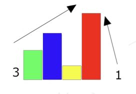
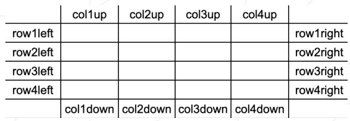
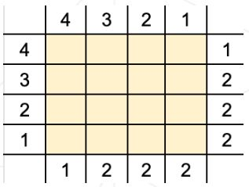
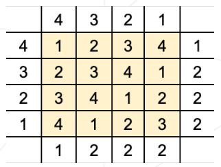

# Exercices en C Rush 01

## Table des matières

- Sujet
- Annexe

## Sujet

```
Dossier de rendu : ex00/
Fichiers à rendre :Tous les fichiers nécessaires
Fonctions Autorisées :write, malloc, free
```

- Votre code source sera compilé par la commande :cc -Wall -Wextra -Werror -o rush-01 *.c
- Votre dossier de rendu devra contenir tout ce qui sera nécessaire à la compilation de votre programme.
- Créez un programme qui résoud le problème suivant :
- Sur une map de 4 par 4, placez des caisses de taille 1 à 4 de manière à ce que chaque ligne et colonne voie le bon nombre de caisses de chaque point de vue possible.
- Exemple : la caisse de taille 3 cache ici la caisse de taille 1, ce qui fait qu’il n’y a que 3 boites visibles de la gauche. De la droite, la caisse de taille 4 cache toutes les autres caisses, il y a donc une seule caisse de visible.



- Chacun des vues (deux par ligne et deux par colonne) aura une valeur donnée, allant de 1 à 4. Votre programme doit placer les caisses correctement, tout en faisant attention à n’avoir qu’une seule caisse de chaque hauteur sur chaque ligne et colonne.
- Si il y a plusieurs solution, vous devez afficher la première que vous trouverez.
- Le programme sera lancé de la façon suvante :
  
```bash
    > ./rush-01 "col1up col2up col3up col4up col1down col2down col3down col4down row1left row2left row3left row4left row1right row2right row3right row4right"
```

- (cf. annexe 1)
- col1up correspond à la valeur pour le point de vue du haut de la colonne de gauche. Chaque valeur doit être comprise entre 1 et 4.
- Vous ne devez accepter que les inputs respectant ce format. Tout autre format doit être considéré comme une erreur.
- Vous devrez afficher en sortie la résolution comme suit :

```bash
    >./rush-01 "4 3 2 1 1 2 2 2 4 3 2 1 1 2 2 2" | cat -e
    1 2 3 4$
    2 3 4 1$
    3 4 1 2$
    4 1 2 3$
```

- (cf. annexe 2 et 3)
- En cas d’erreur ou si vous ne trouvez pas de solution, vous écrirez seulement "Error" suivi d’un retour à la ligne.
- Si vous voulez des points bonus essayez de gerer d’autre taille de map (jusqu’a 9x9 ??).
- Si la partie obligatoire ne passe pas les tests vous aurez 0.

## Annexe

Ce qui suit est une représentation artistique de votre programme. Vous devez, bien
entendu, respecter les consignes de rendu telles que décrites dans la partie précedente.
Ces visualisations ont pour unique but de vous aider à appréhender ce sujet.

- Annexe 1 :



- Représentation du lancement du programme avec col_up, col_down, row_left et
    row_right
- Annexe 2 :



- En remplacant les col* et row*, on obtient ceci.
- Annexe 3 :



- Votre programme doit remplir les cases intérieures, et renvoyer la réponse tel que
    demandé dans le sujet.
