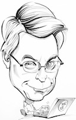

# Clean code

## Introduction

Video :

https://www.youtube.com/watch?v=7EmboKQH8lM&t=1s

- Start: 10:55
- End: 24:30
- Utiliser les sous-titres 

## Keywords

- Code quality / code review
- Embedded software - Software runs everything
- Programmers killing people
- Society is dependant on software
- Programmers rule the world
- Software regulations ?
- Ethics of software

## Développement sécurisé

[ANSSI Développement sécurisé](https://www.ssi.gouv.fr/guide/regles-de-programmation-pour-le-developpement-securise-de-logiciels-en-langage-c/)

## References books

[Bonnes pratiques ANSSI](https://www.ssi.gouv.fr/administration/bonnes-pratiques/)

[ANSSI - sécurisation GNU/Linux](https://www.ssi.gouv.fr/administration/guide/recommandations-de-securite-relatives-a-un-systeme-gnulinux/)

[ANSSI - sécurisation IOT](https://www.ssi.gouv.fr/administration/guide/recommandations-relatives-a-la-securite-des-systemes-dobjets-connectes/)

[ANSSI - Sécurisation client web](https://www.ssi.gouv.fr/administration/guide/recommandations-pour-la-securisation-des-sites-web/)

[ANSSI - OpenSSH](https://www.ssi.gouv.fr/administration/guide/recommandations-pour-un-usage-securise-dopenssh/)

## Follow Up: 

### Software architecture: SOLID

[SOLID principles](https://blog.cleancoder.com/uncle-bob/2020/10/18/Solid-Relevance.html)

### Cleancoders website

http://cleancoder.com/products

### Playlist: Uncle Bob Clean Code

1. https://www.youtube.com/watch?v=7EmboKQH8lM&t=1s
2. https://www.youtube.com/watch?v=2a_ytyt9sf8
3. https://www.youtube.com/watch?v=Qjywrq2gM8o
4. https://www.youtube.com/watch?v=58jGpV2Cg50
5. https://www.youtube.com/watch?v=sn0aFEMVTpA
6. https://www.youtube.com/watch?v=l-gF0vDhJVI