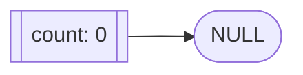
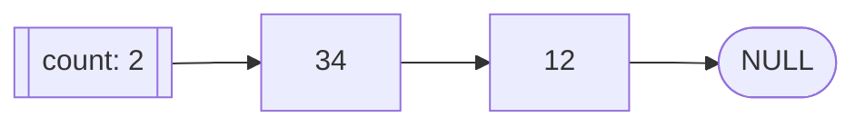
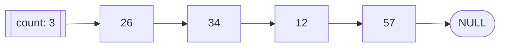

# La liste chainée

## 1 - Introduction

Une liste chaînée est une structure de données à l’intérieur de laquelle les objets sont ordonnés de façon linéaire. À la différence d’un tableau, où l’ordre linéaire est déterminé par les indices du tableau, l’ordre dans une liste chaînée est déterminé par un pointeur dans chacun des objets.

## 2 - Représentation d’une liste simplement chaînée


- Toutes les données sont du même type
- Tête de liste
- Maillon ou noeud
- Pointeur vers un noeud

## 3 - Caractéristiques d’une liste simplement chaînée

- Il est impossible d'accéder directement à l'élément i de la liste chainée. Il faut consulter les i-1 premiers éléments.
- L’ajout ou le retrait d’un nœud dans la liste ne nécessite le déplacement d’aucune donnée en mémoire.
- Les données n’ont pas besoin d’être (et ne sont probablement pas) contigües en mémoire.
- la taille est inconnue au départ, la liste peut avoir autant d'éléments que la mémoire le permet. 
- Il est possible d'ajouter, de supprimer, d'intervertir des éléments d'une liste chaînée sans avoir à recréer la liste en entier, mais en manipulant simplement leurs pointeurs.
- L'entête d'une liste chaînée est composé de deux parties :
    - le nombre d'éléments de la liste
    - l'adresse du premier élément ou NULL
- Chaque élément d'une liste chaînée est composé de deux parties :
    - la valeur que vous voulez stocker ( ou une structure )
    - l'adresse de l'élément suivant. S'il n'y a pas d'élément suivant, alors l'adresse sera NULL, et désignera la fin de la liste.

## 4 - Les services à offrir dans une liste chaînée

Une liste chaînée devrait au minimum offrir les fonctionnalités suivantes :

- Création
- Consultation (au début, à la fin et ailleurs)
- Ajout (au début, à la fin et ailleurs)
- Retrait (au début, à la fin et ailleurs)
- Consultation de la longueur

Les diapositives qui suivent illustrent le fonctionnement des différents services d’une liste simplement chaînée.

Il existe plusieurs façon d’implanter une liste. Celle qui a été choisie pose que le premier nœud possède l’indice 0 et que le dernier nœud
possède l’indice _n - 1_ où _n_ est le nombre de
nœuds de la liste.


## 5 - Les services d'une liste chainée

### 5.1 -Création de la liste

Algorithme :

```
On fait pointer la tête vers NULL.
On initialise le nombre de nœuds à 0.
```

Schéma :




### 5.2 - Consultation du ième élément

Algorithme :

```
SI i ≥ 0 et i < nombre de nœuds de la liste ALORS
    On fait pointer un pointeur sur le premier nœud.
    TANT QUE i > 0 BOUCLE
        Faire pointer le pointeur vers le prochain nœud.
        i = i - 1
    FIN TANT QUE
FINSI
```
Schéma :



### 5.3 - Ajout au début de la liste

Algorithme :
```
On tente de créer un nouveau nœud.
SI la création fut un succès ALORS
    On fait pointer le nouveau nœud vers le premier noeud
    On initialise le nœud.
    On fait pointer la tête de liste vers le nouveau nœud
    On incrémente le nombre de nœuds.
FINSI
```

Schéma initial / final


### 5.4 - Ajout à la fin de la liste

Algorithme :
```
SI la liste est vide ALORS
    On ajoute au début de la liste
SINON
    On tente de créer un nouveau nœud.
    SI la création fut un succès ALORS
        On positionne un pointeur sur le dernier élément de la liste (voir
consulter ième élément).
        On initialise les champs du nouveau nœud.
        On fait pointer le dernier nœud sur le nouveau nœud.
        On incrémente le nombre de nœuds.
    FINSI
FINSI
```

Schéma initial / final


### 5.5 - Ajout à la ième position

Algorithme :
```
SI i = 0 OU la liste est vide ALORS
    On ajoute au début de la liste
SINON SI i < nombre de nœuds de la liste ALORS
    On tente de créer un nouveau nœud.
    SI la création fut un succès ALORS
        On positionne un pointeur sur le i-1ème nœud.
        On initialise les données du nouveau nœud.
        On fait pointer le nouveau nœud sur le ième nœud (NULL si on ajoute à
la fin).
        On fait pointer le i-1ème nœud sur le nouveau.
        On incrémente le nombre de nœuds.
    FINSI
FINSI
```

Schéma initial / final



### 5.6 - Retrait au début de la liste

Algorithme :
```
SI la liste n’est pas vide ALORS
    On fait pointer un pointeur sur le premier élément de la liste.
    On fait pointer la tête de liste sur le deuxième nœud (NULL s’il
n’y avait qu’un seul nœud).
    On détruit le nœud pointé par le pointeur.
    On décrémente le nombre de nœuds.
FINSI
```

Schéma initial / final


### 5.7 - Retrait à la fin de la liste

Algorithme :
```
SI la liste n’est pas vide ALORS
    SI la liste ne contient qu’un seul élément ALORS
        Retirer au début de la liste.
    SINON
        On fait pointer un pointeur sur l’élément à l’indice nombre de nœuds
        On détruit le dernier nœud.
        On fait pointer l’avant dernier vers NULL.
        On décrémente le nombre de nœuds.
    FINSI
FINSI
```

Schéma initial / final


### 5.8 - Retrait à la ième position

Algorithme :
```
SI i ≥ 0 et i < nombre de nœuds de la liste ALORS
    SI la liste ne contient qu’un seul élément ALORS
        Retirer au début de la liste.
    SINON
        On fait pointer un pointeur sur l’élément à l’indice i – 1.
        On fait pointer un pointeur sur l’élément à l’indice i.
        On fait pointer le i-1ème nœud sur le i+1ème nœud (NULL si on détruit le dernier).
        On détruit le ième nœud.
        On décrémente le nombre de nœuds.
    FINSI
FINSI
```

Schéma initial / final


